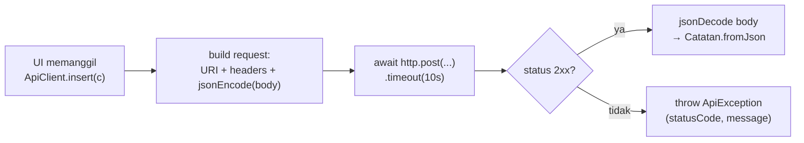

# Pertemuan 5 (REST API CRUD) Implementation Plan

> **For agentic workers:** REQUIRED SUB-SKILL: Use superpowers:subagent-driven-development (recommended) or superpowers:executing-plans to implement this plan task-by-task. Steps use checkbox (`- [ ]`) syntax for tracking.

**Goal:** Bangun backend Laravel `pertemuan-5-be/` (5 endpoint CRUD + middleware + tests) dan modul `pertemuan-5/MODUL_PERTEMUAN_5.md` (8 langkah paralel P4) sesuai spec `2026-06-02-pertemuan-5-design.md`.

**Architecture:** Laravel 11 fresh project, satu resource `catatan`, proteksi X-API-Key, response shape `{success,data,message}`. Modul markdown paralel P4 yang menggantikan `DbHelper` (sqflite) dengan `ApiClient` (package:http).

**Tech Stack:** Laravel 11, PHP 8.2+, SQLite (dev) / Postgres (prod), PHPUnit. Modul mahasiswa: Flutter + `package:http`.

**Base path:** `/Users/mac14m1max/Documents/Projek/Praktikum/materi-pengajaran/`

---

## File Structure

**Backend (`pertemuan-5-be/`):**
- `composer.json`, `.env.example`, `README.md`
- `app/Http/Middleware/VerifyApiKey.php` — proteksi X-API-Key
- `app/Http/Controllers/Api/CatatanController.php` — 5 method CRUD
- `app/Models/Catatan.php` — Eloquent model
- `database/migrations/2026_06_02_000001_create_catatan_table.php`
- `database/seeders/CatatanSeeder.php` — 3 contoh catatan
- `routes/api.php` — register resource routes
- `bootstrap/app.php` — register middleware alias `api.key`
- `config/app.php` — tambah `'api_key' => env('API_KEY')`
- `tests/Feature/CatatanApiTest.php` — feature test 5 endpoint + auth

**Modul (`pertemuan-5/`):**
- `pertemuan-5/MODUL_PERTEMUAN_5.md` — 8 langkah

---

## Task 1: Scaffold Laravel project

**Files:**
- Create: `pertemuan-5-be/` (seluruh project)

- [ ] **Step 1: Buat project Laravel 11 lewat composer**

Run:
```bash
cd /Users/mac14m1max/Documents/Projek/Praktikum/materi-pengajaran
composer create-project laravel/laravel:^11.0 pertemuan-5-be --no-interaction
```
Expected: folder `pertemuan-5-be/` terisi struktur Laravel default; `php artisan --version` menunjukkan 11.x.

- [ ] **Step 2: Gunakan SQLite untuk dev**

Edit `pertemuan-5-be/.env`:
- Ubah `DB_CONNECTION=sqlite`
- Hapus / komentari baris `DB_HOST`, `DB_PORT`, `DB_DATABASE`, `DB_USERNAME`, `DB_PASSWORD`
- Tambah baris baru: `API_KEY=dev-secret-123`

Buat file DB:
```bash
cd pertemuan-5-be && touch database/database.sqlite
```

- [ ] **Step 3: Update `.env.example` agar match**

Edit `pertemuan-5-be/.env.example`: ganti `DB_CONNECTION=mysql` → `DB_CONNECTION=sqlite`, hapus DB_* lain, tambah `API_KEY=dev-secret-123`.

- [ ] **Step 4: Verifikasi project bisa run**

Run:
```bash
cd pertemuan-5-be && php artisan migrate
```
Expected: "Migration table created successfully" + default user/cache/jobs tables ter-create di SQLite tanpa error.

- [ ] **Step 5: Commit**

```bash
cd /Users/mac14m1max/Documents/Projek/Praktikum/materi-pengajaran
git add pertemuan-5-be
git commit -m "feat(pertemuan-5-be): scaffold laravel 11 project with sqlite + API_KEY env"
```

---

## Task 2: Migration tabel `catatan`

**Files:**
- Create: `pertemuan-5-be/database/migrations/2026_06_02_000001_create_catatan_table.php`

- [ ] **Step 1: Buat migration**

Run:
```bash
cd pertemuan-5-be && php artisan make:migration create_catatan_table --create=catatan
```
Expected: file migration baru di `database/migrations/`.

- [ ] **Step 2: Isi schema**

Edit file migration yang baru dibuat. Ganti method `up()`:
```php
public function up(): void
{
    Schema::create('catatan', function (Blueprint $table) {
        $table->id();
        $table->string('judul', 150);
        $table->text('isi');
        $table->string('kategori', 50);
        $table->timestamp('dibuat_pada');
        $table->timestamps();
    });
}
```

- [ ] **Step 3: Run migration**

Run:
```bash
cd pertemuan-5-be && php artisan migrate
```
Expected: "Migrated:" baris yang menyebut `create_catatan_table` muncul. Verifikasi:
```bash
sqlite3 pertemuan-5-be/database/database.sqlite ".schema catatan"
```
Expected: SQL CREATE TABLE catatan dengan 7 kolom (id, judul, isi, kategori, dibuat_pada, created_at, updated_at).

- [ ] **Step 4: Commit**

```bash
git add pertemuan-5-be/database/migrations
git commit -m "feat(pertemuan-5-be): add catatan table migration"
```

---

## Task 3: Model `Catatan` + Seeder

**Files:**
- Create: `pertemuan-5-be/app/Models/Catatan.php`
- Create: `pertemuan-5-be/database/seeders/CatatanSeeder.php`
- Modify: `pertemuan-5-be/database/seeders/DatabaseSeeder.php`

- [ ] **Step 1: Buat model**

Run:
```bash
cd pertemuan-5-be && php artisan make:model Catatan
```

- [ ] **Step 2: Isi model**

Ganti isi `app/Models/Catatan.php`:
```php
<?php

namespace App\Models;

use Illuminate\Database\Eloquent\Model;

class Catatan extends Model
{
    protected $table = 'catatan';

    protected $fillable = ['judul', 'isi', 'kategori', 'dibuat_pada'];

    protected $casts = [
        'dibuat_pada' => 'datetime',
    ];
}
```

- [ ] **Step 3: Buat seeder**

Run:
```bash
cd pertemuan-5-be && php artisan make:seeder CatatanSeeder
```

Ganti isi `database/seeders/CatatanSeeder.php`:
```php
<?php

namespace Database\Seeders;

use App\Models\Catatan;
use Illuminate\Database\Seeder;

class CatatanSeeder extends Seeder
{
    public function run(): void
    {
        Catatan::create([
            'judul' => 'Belajar Async/Await',
            'isi' => 'Pahami Future<T> dan await sebelum lanjut ke HTTP.',
            'kategori' => 'Kuliah',
            'dibuat_pada' => now()->subDays(2),
        ]);
        Catatan::create([
            'judul' => 'Tugas Mobile Pertemuan 5',
            'isi' => 'Refactor DbHelper menjadi ApiClient.',
            'kategori' => 'Tugas',
            'dibuat_pada' => now()->subDay(),
        ]);
        Catatan::create([
            'judul' => 'Beli kopi',
            'isi' => 'Sebelum praktikum.',
            'kategori' => 'Pribadi',
            'dibuat_pada' => now(),
        ]);
    }
}
```

- [ ] **Step 4: Daftarkan seeder di `DatabaseSeeder`**

Edit `database/seeders/DatabaseSeeder.php`. Di dalam `public function run()`, ganti isinya menjadi:
```php
public function run(): void
{
    $this->call(CatatanSeeder::class);
}
```

- [ ] **Step 5: Jalankan seeder**

```bash
cd pertemuan-5-be && php artisan db:seed
```
Expected: "Database seeding completed successfully." Verifikasi:
```bash
sqlite3 pertemuan-5-be/database/database.sqlite "SELECT COUNT(*) FROM catatan;"
```
Expected: `3`.

- [ ] **Step 6: Commit**

```bash
git add pertemuan-5-be/app/Models pertemuan-5-be/database/seeders
git commit -m "feat(pertemuan-5-be): add Catatan model and seeder"
```

---

## Task 4: Middleware `VerifyApiKey` + config

**Files:**
- Create: `pertemuan-5-be/app/Http/Middleware/VerifyApiKey.php`
- Modify: `pertemuan-5-be/config/app.php`
- Modify: `pertemuan-5-be/bootstrap/app.php`

- [ ] **Step 1: Tambah key di `config/app.php`**

Edit `pertemuan-5-be/config/app.php`. Di array return-nya, di dekat bagian `'name' => env('APP_NAME', 'Laravel'),`, sisipkan:
```php
'api_key' => env('API_KEY'),
```

- [ ] **Step 2: Buat middleware**

Buat file `pertemuan-5-be/app/Http/Middleware/VerifyApiKey.php`:
```php
<?php

namespace App\Http\Middleware;

use Closure;
use Illuminate\Http\Request;
use Symfony\Component\HttpFoundation\Response;

class VerifyApiKey
{
    public function handle(Request $request, Closure $next): Response
    {
        $expected = config('app.api_key');
        $provided = $request->header('X-API-Key');

        if (!$expected || $provided !== $expected) {
            return response()->json([
                'success' => false,
                'message' => 'API key tidak valid.',
            ], 401);
        }

        return $next($request);
    }
}
```

- [ ] **Step 3: Register alias `api.key` di `bootstrap/app.php`**

Edit `pertemuan-5-be/bootstrap/app.php`. Ganti blok `withMiddleware`:
```php
->withMiddleware(function (Middleware $middleware): void {
    $middleware->alias([
        'api.key' => \App\Http\Middleware\VerifyApiKey::class,
    ]);
})
```

- [ ] **Step 4: Commit**

```bash
git add pertemuan-5-be/app/Http/Middleware pertemuan-5-be/config/app.php pertemuan-5-be/bootstrap/app.php
git commit -m "feat(pertemuan-5-be): add VerifyApiKey middleware + config binding"
```

---

## Task 5: Feature test — GET list (TDD)

**Files:**
- Create: `pertemuan-5-be/tests/Feature/CatatanApiTest.php`
- Modify: `pertemuan-5-be/phpunit.xml` (set DB_DATABASE for testing)

- [ ] **Step 1: Pastikan testing DB pakai sqlite memory**

Edit `pertemuan-5-be/phpunit.xml`. Di blok `<php>`, pastikan ada:
```xml
<env name="DB_CONNECTION" value="sqlite"/>
<env name="DB_DATABASE" value=":memory:"/>
<env name="API_KEY" value="test-key"/>
```
Tambah kalau belum ada. Hapus baris `DB_DATABASE` lain yang mungkin sudah ada agar tidak konflik.

- [ ] **Step 2: Buat file test dengan failing test pertama (GET list)**

Buat `pertemuan-5-be/tests/Feature/CatatanApiTest.php`:
```php
<?php

namespace Tests\Feature;

use App\Models\Catatan;
use Illuminate\Foundation\Testing\RefreshDatabase;
use Tests\TestCase;

class CatatanApiTest extends TestCase
{
    use RefreshDatabase;

    private array $headers = ['X-API-Key' => 'test-key', 'Accept' => 'application/json'];

    public function test_index_returns_all_catatan(): void
    {
        Catatan::create([
            'judul' => 'A', 'isi' => 'isi A', 'kategori' => 'Kuliah',
            'dibuat_pada' => now(),
        ]);
        Catatan::create([
            'judul' => 'B', 'isi' => 'isi B', 'kategori' => 'Tugas',
            'dibuat_pada' => now(),
        ]);

        $res = $this->withHeaders($this->headers)->getJson('/api/catatan');

        $res->assertStatus(200)
            ->assertJson(['success' => true])
            ->assertJsonCount(2, 'data')
            ->assertJsonStructure(['success', 'data' => [['id', 'judul', 'isi', 'kategori', 'dibuat_pada']]]);
    }
}
```

- [ ] **Step 3: Run test — harus FAIL (route belum ada)**

```bash
cd pertemuan-5-be && php artisan test --filter=test_index_returns_all_catatan
```
Expected: FAIL — status 404 atau "route not defined".

- [ ] **Step 4: Implement minimal — routes + controller**

Edit `pertemuan-5-be/routes/api.php`. Ganti seluruh isi:
```php
<?php

use App\Http\Controllers\Api\CatatanController;
use Illuminate\Support\Facades\Route;

Route::middleware('api.key')->group(function () {
    Route::get('/catatan', [CatatanController::class, 'index']);
});
```

Buat `pertemuan-5-be/app/Http/Controllers/Api/CatatanController.php`:
```php
<?php

namespace App\Http\Controllers\Api;

use App\Http\Controllers\Controller;
use App\Models\Catatan;
use Illuminate\Http\JsonResponse;

class CatatanController extends Controller
{
    public function index(): JsonResponse
    {
        $data = Catatan::orderBy('dibuat_pada', 'desc')->get();
        return response()->json(['success' => true, 'data' => $data]);
    }
}
```

- [ ] **Step 5: Run test — harus PASS**

```bash
cd pertemuan-5-be && php artisan test --filter=test_index_returns_all_catatan
```
Expected: PASS.

- [ ] **Step 6: Commit**

```bash
git add pertemuan-5-be/tests pertemuan-5-be/phpunit.xml pertemuan-5-be/routes/api.php pertemuan-5-be/app/Http/Controllers/Api
git commit -m "feat(pertemuan-5-be): GET /api/catatan returns list"
```

---

## Task 6: Auth — test 401 tanpa API key

**Files:**
- Modify: `pertemuan-5-be/tests/Feature/CatatanApiTest.php`

- [ ] **Step 1: Tambah failing test**

Tambah method di dalam class `CatatanApiTest`:
```php
public function test_index_requires_api_key(): void
{
    $res = $this->getJson('/api/catatan');
    $res->assertStatus(401)->assertJson(['success' => false]);
}

public function test_index_rejects_wrong_api_key(): void
{
    $res = $this->withHeaders(['X-API-Key' => 'wrong'])->getJson('/api/catatan');
    $res->assertStatus(401)->assertJson(['success' => false]);
}
```

- [ ] **Step 2: Run tests**

```bash
cd pertemuan-5-be && php artisan test --filter=CatatanApiTest
```
Expected: 3 tests pass (middleware sudah aktif dari Task 4-5).

- [ ] **Step 3: Commit**

```bash
git add pertemuan-5-be/tests/Feature/CatatanApiTest.php
git commit -m "test(pertemuan-5-be): verify API key enforcement on index"
```

---

## Task 7: GET show (single)

**Files:**
- Modify: `pertemuan-5-be/tests/Feature/CatatanApiTest.php`
- Modify: `pertemuan-5-be/routes/api.php`
- Modify: `pertemuan-5-be/app/Http/Controllers/Api/CatatanController.php`

- [ ] **Step 1: Failing tests**

Tambah di `CatatanApiTest`:
```php
public function test_show_returns_single_catatan(): void
{
    $c = Catatan::create([
        'judul' => 'X', 'isi' => 'isi X', 'kategori' => 'Pribadi',
        'dibuat_pada' => now(),
    ]);

    $res = $this->withHeaders($this->headers)->getJson("/api/catatan/{$c->id}");

    $res->assertStatus(200)
        ->assertJson(['success' => true, 'data' => ['id' => $c->id, 'judul' => 'X']]);
}

public function test_show_returns_404_when_missing(): void
{
    $res = $this->withHeaders($this->headers)->getJson('/api/catatan/9999');
    $res->assertStatus(404)->assertJson(['success' => false]);
}
```

- [ ] **Step 2: Run — FAIL (route show belum ada)**

```bash
cd pertemuan-5-be && php artisan test --filter=test_show
```
Expected: FAIL — 404 untuk test pertama juga karena route belum terdaftar.

- [ ] **Step 3: Tambah route + method**

Edit `routes/api.php`. Di dalam group `api.key`, tambah:
```php
Route::get('/catatan/{id}', [CatatanController::class, 'show']);
```

Tambah method di `CatatanController`:
```php
public function show(int $id): JsonResponse
{
    $c = Catatan::find($id);
    if (!$c) {
        return response()->json(['success' => false, 'message' => 'Catatan tidak ditemukan.'], 404);
    }
    return response()->json(['success' => true, 'data' => $c]);
}
```

- [ ] **Step 4: Run — PASS**

```bash
cd pertemuan-5-be && php artisan test --filter=test_show
```
Expected: 2 tests pass.

- [ ] **Step 5: Commit**

```bash
git add pertemuan-5-be
git commit -m "feat(pertemuan-5-be): GET /api/catatan/{id} with 404 handling"
```

---

## Task 8: POST store

**Files:**
- Modify: `tests/Feature/CatatanApiTest.php`, `routes/api.php`, `CatatanController.php`

- [ ] **Step 1: Failing tests**

Tambah di `CatatanApiTest`:
```php
public function test_store_creates_catatan(): void
{
    $payload = [
        'judul' => 'Baru', 'isi' => 'Isi baru', 'kategori' => 'Kuliah',
    ];

    $res = $this->withHeaders($this->headers)->postJson('/api/catatan', $payload);

    $res->assertStatus(201)
        ->assertJson(['success' => true, 'data' => ['judul' => 'Baru']]);
    $this->assertDatabaseHas('catatan', ['judul' => 'Baru']);
}

public function test_store_validates_required_fields(): void
{
    $res = $this->withHeaders($this->headers)->postJson('/api/catatan', []);
    $res->assertStatus(422)
        ->assertJsonValidationErrors(['judul', 'isi', 'kategori']);
}
```

- [ ] **Step 2: Run — FAIL**

```bash
cd pertemuan-5-be && php artisan test --filter=test_store
```
Expected: FAIL — route belum ada.

- [ ] **Step 3: Implement**

Edit `routes/api.php`, tambah dalam group:
```php
Route::post('/catatan', [CatatanController::class, 'store']);
```

Tambah di `CatatanController`:
```php
use Illuminate\Http\Request;

public function store(Request $request): JsonResponse
{
    $data = $request->validate([
        'judul' => 'required|string|max:150',
        'isi' => 'required|string',
        'kategori' => 'required|string|max:50',
        'dibuat_pada' => 'nullable|date',
    ]);
    $data['dibuat_pada'] = $data['dibuat_pada'] ?? now();
    $c = Catatan::create($data);
    return response()->json(['success' => true, 'data' => $c], 201);
}
```

- [ ] **Step 4: Run — PASS**

```bash
cd pertemuan-5-be && php artisan test --filter=test_store
```
Expected: 2 pass.

- [ ] **Step 5: Commit**

```bash
git add pertemuan-5-be
git commit -m "feat(pertemuan-5-be): POST /api/catatan with validation"
```

---

## Task 9: PUT update

- [ ] **Step 1: Failing tests**

Tambah di `CatatanApiTest`:
```php
public function test_update_modifies_catatan(): void
{
    $c = Catatan::create([
        'judul' => 'Lama', 'isi' => 'isi', 'kategori' => 'Kuliah',
        'dibuat_pada' => now(),
    ]);

    $res = $this->withHeaders($this->headers)->putJson("/api/catatan/{$c->id}", [
        'judul' => 'Baru', 'isi' => 'isi baru', 'kategori' => 'Tugas',
    ]);

    $res->assertStatus(200)
        ->assertJson(['success' => true, 'data' => ['judul' => 'Baru', 'kategori' => 'Tugas']]);
    $this->assertDatabaseHas('catatan', ['id' => $c->id, 'judul' => 'Baru']);
}

public function test_update_returns_404_when_missing(): void
{
    $res = $this->withHeaders($this->headers)->putJson('/api/catatan/9999', [
        'judul' => 'X', 'isi' => 'y', 'kategori' => 'Pribadi',
    ]);
    $res->assertStatus(404);
}
```

- [ ] **Step 2: Run — FAIL**

```bash
cd pertemuan-5-be && php artisan test --filter=test_update
```

- [ ] **Step 3: Implement**

Edit `routes/api.php`:
```php
Route::put('/catatan/{id}', [CatatanController::class, 'update']);
```

Tambah di `CatatanController`:
```php
public function update(Request $request, int $id): JsonResponse
{
    $c = Catatan::find($id);
    if (!$c) {
        return response()->json(['success' => false, 'message' => 'Catatan tidak ditemukan.'], 404);
    }
    $data = $request->validate([
        'judul' => 'required|string|max:150',
        'isi' => 'required|string',
        'kategori' => 'required|string|max:50',
    ]);
    $c->update($data);
    return response()->json(['success' => true, 'data' => $c]);
}
```

- [ ] **Step 4: Run — PASS**

```bash
cd pertemuan-5-be && php artisan test --filter=test_update
```

- [ ] **Step 5: Commit**

```bash
git add pertemuan-5-be
git commit -m "feat(pertemuan-5-be): PUT /api/catatan/{id} with 404 + validation"
```

---

## Task 10: DELETE destroy

- [ ] **Step 1: Failing tests**

Tambah di `CatatanApiTest`:
```php
public function test_destroy_removes_catatan(): void
{
    $c = Catatan::create([
        'judul' => 'X', 'isi' => 'y', 'kategori' => 'Pribadi',
        'dibuat_pada' => now(),
    ]);

    $res = $this->withHeaders($this->headers)->deleteJson("/api/catatan/{$c->id}");

    $res->assertStatus(200)->assertJson(['success' => true]);
    $this->assertDatabaseMissing('catatan', ['id' => $c->id]);
}

public function test_destroy_returns_404_when_missing(): void
{
    $res = $this->withHeaders($this->headers)->deleteJson('/api/catatan/9999');
    $res->assertStatus(404);
}
```

- [ ] **Step 2: Run — FAIL**

```bash
cd pertemuan-5-be && php artisan test --filter=test_destroy
```

- [ ] **Step 3: Implement**

Edit `routes/api.php`:
```php
Route::delete('/catatan/{id}', [CatatanController::class, 'destroy']);
```

Tambah di `CatatanController`:
```php
public function destroy(int $id): JsonResponse
{
    $c = Catatan::find($id);
    if (!$c) {
        return response()->json(['success' => false, 'message' => 'Catatan tidak ditemukan.'], 404);
    }
    $c->delete();
    return response()->json(['success' => true, 'message' => 'Catatan dihapus.']);
}
```

- [ ] **Step 4: Run — PASS**

```bash
cd pertemuan-5-be && php artisan test --filter=test_destroy
```

- [ ] **Step 5: Full test suite**

```bash
cd pertemuan-5-be && php artisan test
```
Expected: semua 11 test pass.

- [ ] **Step 6: Commit**

```bash
git add pertemuan-5-be
git commit -m "feat(pertemuan-5-be): DELETE /api/catatan/{id} completing CRUD"
```

---

## Task 11: Smoke test manual via curl + README BE

**Files:**
- Create: `pertemuan-5-be/README.md`

- [ ] **Step 1: Jalankan server lokal di background untuk smoke test**

Run di background:
```bash
cd pertemuan-5-be && php artisan serve --port=8000
```

- [ ] **Step 2: Verifikasi 5 endpoint via curl**

```bash
# GET list
curl -s -H "X-API-Key: dev-secret-123" http://127.0.0.1:8000/api/catatan | head -c 300
# POST
curl -s -X POST -H "X-API-Key: dev-secret-123" -H "Content-Type: application/json" \
  -d '{"judul":"curl","isi":"x","kategori":"Tugas"}' http://127.0.0.1:8000/api/catatan
# GET show (id=1)
curl -s -H "X-API-Key: dev-secret-123" http://127.0.0.1:8000/api/catatan/1
# PUT
curl -s -X PUT -H "X-API-Key: dev-secret-123" -H "Content-Type: application/json" \
  -d '{"judul":"updated","isi":"y","kategori":"Pribadi"}' http://127.0.0.1:8000/api/catatan/1
# DELETE
curl -s -X DELETE -H "X-API-Key: dev-secret-123" http://127.0.0.1:8000/api/catatan/1
# Tanpa key (harus 401)
curl -s -o /dev/null -w "%{http_code}\n" http://127.0.0.1:8000/api/catatan
```
Expected: response JSON sukses untuk 5 yang pertama, `401` untuk yang terakhir.

- [ ] **Step 3: Stop server**

Hentikan proses `php artisan serve` di background.

- [ ] **Step 4: Tulis `README.md`**

Buat `pertemuan-5-be/README.md` dengan isi berikut (tulis utuh, bukan placeholder):
```markdown
# Pertemuan 5 — Backend (Laravel REST API)

Backend pendukung modul Praktikum **Pertemuan 5** (mobile programming). Mahasiswa
mengonsumsi endpoint di sini dari aplikasi Flutter sebagai pengganti SQLite (P4).

## Endpoint

| Method | URL                  | Body                                   | Sukses             | Auth |
|--------|----------------------|----------------------------------------|--------------------|------|
| GET    | `/api/catatan`       | —                                      | 200                | ✔    |
| GET    | `/api/catatan/{id}`  | —                                      | 200 / 404          | ✔    |
| POST   | `/api/catatan`       | `{judul,isi,kategori,dibuat_pada?}`    | 201 / 422          | ✔    |
| PUT    | `/api/catatan/{id}`  | `{judul,isi,kategori}`                 | 200 / 404 / 422    | ✔    |
| DELETE | `/api/catatan/{id}`  | —                                      | 200 / 404          | ✔    |

Semua endpoint butuh header `X-API-Key: <API_KEY env>`.

Format response standar: `{ "success": bool, "data": ..., "message"?: ... }`.

## Setup Lokal

```bash
composer install
cp .env.example .env
php artisan key:generate
touch database/database.sqlite
php artisan migrate --seed
php artisan serve   # http://127.0.0.1:8000
```

Cek: `curl -H "X-API-Key: dev-secret-123" http://127.0.0.1:8000/api/catatan`

## Test

```bash
php artisan test
```

## Deploy ke Railway

1. Push repo ke GitHub.
2. Railway → **New Project → Deploy from GitHub** → pilih repo.
3. Tambah **Postgres** plugin → Railway inject `DATABASE_URL`.
4. Set env vars:
   - `APP_KEY` (`php artisan key:generate --show` lokal lalu paste)
   - `API_KEY` (string rahasia)
   - `APP_ENV=production`
   - `APP_DEBUG=false`
   - `DB_CONNECTION=pgsql`
5. Setelah deploy: buka **Railway shell** → `php artisan migrate --force` → opsional `php artisan db:seed --force`.
6. Salin domain publik (mis. `https://xxxx.up.railway.app`) ke modul mahasiswa.

## Catatan

- API key di `.env.example` (`dev-secret-123`) **hanya untuk development**. Rotate untuk production.
- Database `database.sqlite` di-ignore git; tidak akan terkirim.
```

- [ ] **Step 5: Commit**

```bash
git add pertemuan-5-be/README.md
git commit -m "docs(pertemuan-5-be): add README with endpoint table, setup, and Railway deploy"
```

---

## Task 12: Modul Markdown — Bagian 1 (Header s/d Langkah 4)

**Files:**
- Create: `pertemuan-5/MODUL_PERTEMUAN_5.md`

- [ ] **Step 1: Buat file modul dengan bagian Header + Langkah 1–4**

Buat `pertemuan-5/MODUL_PERTEMUAN_5.md`. Tulis konten lengkap berikut (jangan placeholder — semua teks final):

```markdown
# Praktikum Pertemuan 5 — REST API & CRUD Jaringan (HTTP)

## Informasi Umum

| Item             | Keterangan                                                          |
| ---------------- | ------------------------------------------------------------------- |
| Pertemuan        | Minggu 5 (Lanjutan setelah SQLite/CRUD lokal)                       |
| Topik Kuliah     | REST, HTTP method, JSON, `package:http`, error jaringan             |
| Durasi Praktikum | 120 menit                                                           |
| Prasyarat        | Pertemuan 4 selesai (Async/Await, FutureBuilder, repository, Form Create/Edit) |

---

## Tujuan Praktikum

Setelah menyelesaikan praktikum ini, mahasiswa mampu:

1. Menjelaskan perbedaan persistensi **lokal** (SQLite) vs **remote** (REST API).
2. Memakai `package:http` untuk operasi `GET / POST / PUT / DELETE` ke server Laravel.
3. Serialisasi Dart object ↔ JSON lewat `toJson()` & `fromJson()`.
4. Mengirim **header kustom** (`X-API-Key`, `Content-Type`).
5. Menangani **3 kelas error jaringan**: timeout, tidak ada internet, HTTP 4xx/5xx.
6. Mengganti repository `DbHelper` (P4) dengan `ApiClient` **tanpa mengubah UI**.

> P4 menjawab: "Bagaimana data **tidak hilang** saat app ditutup?" — disimpan di disk.
> P5 menjawab: "Bagaimana data **bisa diakses dari banyak device**?" — disimpan di server.

---

## Yang Berubah dari Pertemuan 4

| Aspek                | Pertemuan 4 (SQLite)            | Pertemuan 5 (REST API)                       |
| -------------------- | ------------------------------- | -------------------------------------------- |
| Sumber data          | File lokal `catatan.db`         | Server Laravel (HTTPS)                       |
| Package              | `sqflite` + `path`              | **`http`**                                   |
| Repository           | `DbHelper`                      | **`ApiClient`** (signature method **sama**)  |
| Serialisasi          | `toMap()` int epoch             | `toJson()/fromJson()` ISO-8601 string        |
| Kecepatan akses      | Sangat cepat                    | Tergantung jaringan                          |
| Error mungkin        | DB locked (jarang)              | Timeout, no internet, 4xx/5xx                |
| Init binding         | `WidgetsFlutterBinding.ensureInitialized()` wajib | Tidak wajib (no platform channel) |
| UI / `main.dart`     | —                               | **Tidak berubah** kecuali nama repo          |

---

## Kontrak API (yang sudah disiapkan dosen)

Base URL contoh: `https://pertemuan-5-be.up.railway.app/api`
Semua request wajib header `X-API-Key: <key dari dosen>`.

| Method | URL                  | Body                                          | Sukses                   | Error              |
|--------|----------------------|-----------------------------------------------|--------------------------|--------------------|
| GET    | `/catatan`           | —                                             | 200 `{success,data:[…]}` | 401                |
| GET    | `/catatan/{id}`      | —                                             | 200 `{success,data}`     | 404, 401           |
| POST   | `/catatan`           | `{judul,isi,kategori,dibuat_pada?}`           | 201 `{success,data}`     | 422, 401           |
| PUT    | `/catatan/{id}`      | `{judul,isi,kategori}`                        | 200 `{success,data}`     | 404, 422, 401      |
| DELETE | `/catatan/{id}`      | —                                             | 200 `{success,message}`  | 404, 401           |

Format `Catatan`:
```json
{
  "id": 7,
  "judul": "Tugas Mobile",
  "isi": "Selesaikan modul P5",
  "kategori": "Tugas",
  "dibuat_pada": "2026-06-02T10:30:00.000000Z"
}
```

---

## Alur Praktikum (8 Langkah, 120 menit)

1. Setup project + dependency `http` (10')
2. Konsep REST, HTTP & JSON (15')
3. Refactor model: `toJson`/`fromJson` (10')
4. `ApiClient` singleton + 5 method CRUD (25')
5. Home pakai `FutureBuilder` (15') — paralel P4
6. Form CREATE + EDIT (20') — paralel P4
7. Delete + dialog konfirmasi (10') — paralel P4
8. Polish + error handling network + tes manual (15')

---

## Langkah 1 — Setup Project (10 menit)

### 1.1 Copy dari Pertemuan 4

```bash
cp -r pertemuan_4 pertemuan_5
cd pertemuan_5
```

Atau buat fresh: `flutter create pertemuan_5` lalu salin `lib/main.dart` dari P4.

### 1.2 Ganti dependensi di `pubspec.yaml`

Hapus `sqflite` dan `path`, tambahkan `http`:

```yaml
dependencies:
  flutter:
    sdk: flutter
  cupertino_icons: ^1.0.8

  # === Baru di Pertemuan 5 ===
  http: ^1.2.0      # HTTP client resmi Dart
```

Lalu:
```bash
flutter pub get
```

### 1.3 Hapus file `lib/db_helper.dart`

P5 tidak butuh DbHelper lagi. Hapus file, lalu hapus import-nya di `lib/main.dart`.

### 1.4 Tambah base URL dari dosen

Catat base URL & API key dari papan tulis / LMS. Kita akan pakai di Langkah 4.

### 1.5 Catatan emulator

| Platform                      | Base URL `localhost` |
| ----------------------------- | -------------------- |
| Android emulator              | `http://10.0.2.2:8000` |
| iOS simulator / desktop       | `http://127.0.0.1:8000` |
| Production (Railway dll)      | `https://<domain>` langsung |

> ⚠️ **Android & HTTP plain**: kalau dosen pakai server `http://` (bukan `https`), tambahkan `android:usesCleartextTraffic="true"` di `android/app/src/main/AndroidManifest.xml`. Untuk URL `https://` Railway, tidak perlu.

---

## Langkah 2 — Konsep REST, HTTP & JSON (15 menit)

### 2.1 Apa itu REST?

REST = gaya komunikasi client-server di mana **resource** (mis. "catatan") diakses lewat URL, dan **aksi** dinyatakan lewat HTTP method.

| Aksi (CRUD) | HTTP method | Contoh URL          |
| ----------- | ----------- | ------------------- |
| Read all    | `GET`       | `/api/catatan`      |
| Read one    | `GET`       | `/api/catatan/7`    |
| Create      | `POST`      | `/api/catatan`      |
| Update      | `PUT`       | `/api/catatan/7`    |
| Delete      | `DELETE`    | `/api/catatan/7`    |

### 2.2 Status code yang akan ditemui

| Code | Arti              | Kapan                                              |
| ---- | ----------------- | -------------------------------------------------- |
| 200  | OK                | GET / PUT / DELETE sukses                          |
| 201  | Created           | POST sukses                                        |
| 401  | Unauthorized      | API key salah / tidak dikirim                      |
| 404  | Not Found         | Resource id tidak ada                              |
| 422  | Unprocessable     | Validasi gagal (mis. judul kosong)                 |
| 5xx  | Server error      | Backend down / bug                                 |

### 2.3 JSON & parsing di Dart

JSON dari server adalah **string**. Dart mengubahnya jadi `Map<String, dynamic>`:
```dart
import 'dart:convert';

final body = '{"id":1,"judul":"X"}';
final Map<String, dynamic> map = jsonDecode(body);
print(map['judul']);  // X
```

Sebaliknya, untuk mengirim:
```dart
jsonEncode({'judul': 'X', 'isi': 'y'});  // -> '{"judul":"X","isi":"y"}'
```

---

## Langkah 3 — Refactor Model `Catatan` (10 menit)

Beda dgn P4: `toMap` & `fromMap` diganti `toJson` & `fromJson`, dan `dibuatPada` dikirim sebagai **ISO-8601 string** (bukan int epoch).

Ganti class `Catatan` di `lib/main.dart`:

```dart
class Catatan {
  final int? id;
  final String judul;
  final String isi;
  final String kategori;
  final DateTime dibuatPada;

  Catatan({
    this.id,
    required this.judul,
    required this.isi,
    required this.kategori,
    required this.dibuatPada,
  });

  Map<String, dynamic> toJson() => {
        if (id != null) 'id': id,
        'judul': judul,
        'isi': isi,
        'kategori': kategori,
        'dibuat_pada': dibuatPada.toUtc().toIso8601String(),
      };

  static Catatan fromJson(Map<String, dynamic> m) => Catatan(
        id: m['id'] as int?,
        judul: m['judul'] as String,
        isi: m['isi'] as String,
        kategori: m['kategori'] as String,
        dibuatPada: DateTime.parse(m['dibuat_pada'] as String),
      );

  Catatan copyWith({String? judul, String? isi, String? kategori}) =>
      Catatan(
        id: id,
        judul: judul ?? this.judul,
        isi: isi ?? this.isi,
        kategori: kategori ?? this.kategori,
        dibuatPada: dibuatPada,
      );
}
```

> 💡 **Kenapa ISO-8601 string?** Karena JSON tidak punya tipe `Date`. ISO-8601 (`2026-06-02T10:30:00Z`) adalah format universal yang dimengerti hampir semua bahasa & DB.

---

## Langkah 4 — `ApiClient` (Singleton + HTTP CRUD) (25 menit)

### 4.1 Buat file baru `lib/api_client.dart`

Pola sama dgn `DbHelper` di P4: **singleton** + method 1:1 untuk tiap operasi.

```dart
import 'dart:async';
import 'dart:convert';
import 'dart:io';
import 'package:http/http.dart' as http;
import 'main.dart' show Catatan;

class ApiException implements Exception {
  final int statusCode;
  final String message;
  ApiException(this.statusCode, this.message);
  @override
  String toString() => 'ApiException($statusCode): $message';
}

class ApiClient {
  ApiClient._();
  static final ApiClient instance = ApiClient._();

  // === GANTI DUA KONSTANTA INI SESUAI DOSEN ===
  static const String _baseUrl = 'https://pertemuan-5-be.up.railway.app/api';
  static const String _apiKey  = 'dev-secret-123';
  // ============================================

  static const _timeout = Duration(seconds: 10);

  Map<String, String> get _headers => {
        'X-API-Key': _apiKey,
        'Content-Type': 'application/json',
        'Accept': 'application/json',
      };

  // ===== CRUD =====

  Future<List<Catatan>> getAll() async {
    final res = await _send(() => http.get(
          Uri.parse('$_baseUrl/catatan'),
          headers: _headers,
        ));
    final body = jsonDecode(res.body) as Map<String, dynamic>;
    final list = (body['data'] as List).cast<Map<String, dynamic>>();
    return list.map(Catatan.fromJson).toList();
  }

  Future<Catatan> getById(int id) async {
    final res = await _send(() => http.get(
          Uri.parse('$_baseUrl/catatan/$id'),
          headers: _headers,
        ));
    final body = jsonDecode(res.body) as Map<String, dynamic>;
    return Catatan.fromJson(body['data'] as Map<String, dynamic>);
  }

  Future<Catatan> insert(Catatan c) async {
    final res = await _send(() => http.post(
          Uri.parse('$_baseUrl/catatan'),
          headers: _headers,
          body: jsonEncode(c.toJson()),
        ));
    final body = jsonDecode(res.body) as Map<String, dynamic>;
    return Catatan.fromJson(body['data'] as Map<String, dynamic>);
  }

  Future<Catatan> update(Catatan c) async {
    assert(c.id != null);
    final res = await _send(() => http.put(
          Uri.parse('$_baseUrl/catatan/${c.id}'),
          headers: _headers,
          body: jsonEncode(c.toJson()),
        ));
    final body = jsonDecode(res.body) as Map<String, dynamic>;
    return Catatan.fromJson(body['data'] as Map<String, dynamic>);
  }

  Future<void> delete(int id) async {
    await _send(() => http.delete(
          Uri.parse('$_baseUrl/catatan/$id'),
          headers: _headers,
        ));
  }

  // ===== Helper: kirim + tangani 3 kelas error =====
  Future<http.Response> _send(Future<http.Response> Function() req) async {
    try {
      final res = await req().timeout(_timeout);
      if (res.statusCode >= 200 && res.statusCode < 300) return res;
      throw ApiException(res.statusCode, _extractMessage(res));
    } on SocketException {
      throw ApiException(0, 'Tidak ada koneksi internet.');
    } on TimeoutException {
      throw ApiException(0, 'Server tidak merespons (timeout).');
    }
  }

  String _extractMessage(http.Response res) {
    try {
      final m = jsonDecode(res.body) as Map<String, dynamic>;
      return (m['message'] as String?) ?? 'HTTP ${res.statusCode}';
    } catch (_) {
      return 'HTTP ${res.statusCode}';
    }
  }
}
```

### 4.2 Anatomi method



### 4.3 Anti-pattern yang harus dihindari

❌ **Hard-code URL di banyak tempat**: kalau base URL berubah, harus edit di banyak file.
✅ Simpan di **satu konstanta** `_baseUrl` di `ApiClient`.

❌ **Membungkus setiap call dengan `try/catch` di UI**:
✅ Lempar `ApiException` dari `ApiClient`, biar `FutureBuilder.snapshot.hasError` yang menampilkan.

❌ **Lupa header `Content-Type: application/json`** di POST/PUT:
✅ Selalu pakai `_headers` getter agar konsisten.

---
```

- [ ] **Step 2: Verifikasi file dibuat**

```bash
wc -l /Users/mac14m1max/Documents/Projek/Praktikum/materi-pengajaran/pertemuan-5/MODUL_PERTEMUAN_5.md
```
Expected: > 250 baris.

- [ ] **Step 3: Commit**

```bash
git add pertemuan-5/MODUL_PERTEMUAN_5.md
git commit -m "docs(pertemuan-5): add module header + steps 1-4 (setup, REST concepts, model, ApiClient)"
```

---

## Task 13: Modul Markdown — Bagian 2 (Langkah 5–8 + Ringkasan)

**Files:**
- Modify: `pertemuan-5/MODUL_PERTEMUAN_5.md`

- [ ] **Step 1: Tambahkan Langkah 5 (Home pakai FutureBuilder)**

Append ke `pertemuan-5/MODUL_PERTEMUAN_5.md`:

```markdown
## Langkah 5 — Home pakai `FutureBuilder` (15 menit)

> **Bagus banget**: kalau struktur P4 sudah betul, **kode Home tidak berubah** kecuali ganti `DbHelper` jadi `ApiClient`.

Di `_HomePageState`:

```dart
void _muatUlang() {
  setState(() {
    _futureCatatan = ApiClient.instance.getAll();   // <-- satu-satunya perubahan
  });
}
```

Bagian `FutureBuilder<List<Catatan>>` di `build()` **tetap sama persis** dengan P4:
- 3 state: `connectionState != done` (loading), `hasError` (error), data.
- Pola "refresh on return" setelah `Navigator.pushNamed('/form')` juga tetap sama.

Yang baru: `snapshot.hasError` sekarang bisa menampilkan pesan dari `ApiException`. Pertajam tampilannya:

```dart
if (snapshot.hasError) {
  final e = snapshot.error;
  final pesan = e is ApiException ? e.message : 'Terjadi kesalahan: $e';
  return Center(
    child: Column(
      mainAxisAlignment: MainAxisAlignment.center,
      children: [
        const Icon(Icons.error_outline, size: 48),
        const SizedBox(height: 8),
        Text(pesan, textAlign: TextAlign.center),
        const SizedBox(height: 12),
        FilledButton(onPressed: _muatUlang, child: const Text('Coba lagi')),
      ],
    ),
  );
}
```

Jangan lupa `import 'api_client.dart';` di `main.dart`.

---

## Langkah 6 — Form CREATE + EDIT (20 menit)

Sama dengan P4. Hanya panggilan repo yang berubah:

```dart
Future<void> _simpan() async {
  if (!_formKey.currentState!.validate()) return;
  setState(() => _menyimpan = true);
  try {
    if (_isEdit) {
      final updated = widget.initial!.copyWith(
        judul: _judulCtrl.text.trim(),
        isi: _isiCtrl.text.trim(),
        kategori: _kategori,
      );
      await ApiClient.instance.update(updated);     // <-- ApiClient
    } else {
      final baru = Catatan(
        judul: _judulCtrl.text.trim(),
        isi: _isiCtrl.text.trim(),
        kategori: _kategori,
        dibuatPada: DateTime.now(),
      );
      await ApiClient.instance.insert(baru);        // <-- ApiClient
    }
    if (!mounted) return;
    ScaffoldMessenger.of(context).showSnackBar(SnackBar(
      content: Text(_isEdit ? 'Catatan diperbarui' : 'Catatan ditambahkan'),
    ));
    Navigator.pop(context);
  } on ApiException catch (e) {
    if (!mounted) return;
    setState(() => _menyimpan = false);
    ScaffoldMessenger.of(context).showSnackBar(
      SnackBar(content: Text('Gagal menyimpan: ${e.message}')),
    );
  }
}
```

> 💡 **Beda dengan P4**: catch `ApiException` (bukan generic `Exception`) supaya pesan dari server (`message` JSON) yang muncul, bukan stacktrace.

---

## Langkah 7 — Delete dengan Dialog Konfirmasi (10 menit)

Sama persis dengan P4, kecuali baris penghapus:

```dart
if (yakin == true) {
  try {
    await ApiClient.instance.delete(c.id!);          // <-- ApiClient
    if (!mounted) return;
    _muatUlang();
    ScaffoldMessenger.of(context).showSnackBar(
      SnackBar(content: Text('"${c.judul}" dihapus')),
    );
  } on ApiException catch (e) {
    if (!mounted) return;
    ScaffoldMessenger.of(context).showSnackBar(
      SnackBar(content: Text('Gagal menghapus: ${e.message}')),
    );
  }
}
```

---

## Langkah 8 — Polish + Error Jaringan + Tes Manual (15 menit)

### 8.1 Skenario tes manual

Jalankan `flutter run`, lalu uji:

- [ ] List kosong → empty state (kalau DB di server kosong) atau muncul 3 seed dari dosen.
- [ ] Tap FAB **Tambah** → form muncul, AppBar "Tambah Catatan".
- [ ] Submit form kosong → validator menolak.
- [ ] Isi & simpan → kembali ke Home, list bertambah (sumber: server).
- [ ] **Tutup app paksa → buka lagi → data tetap ada** (kini ada di server).
- [ ] **Buka app dari device lain / emulator lain → data yang sama muncul.** ← bukti inti P5.
- [ ] Tap item → halaman Detail muncul.
- [ ] Tap **Edit** → form muncul, field terisi → ubah → simpan → list ter-update.
- [ ] Tap **Hapus** → dialog → Batal → tidak terhapus. Lagi → Hapus → hilang.

### 8.2 Skenario error jaringan (yang baru di P5)

- [ ] **Matikan Wi-Fi** → tap refresh → muncul pesan "Tidak ada koneksi internet" + tombol "Coba lagi".
- [ ] **Ubah `_baseUrl` ke domain yang tidak ada** → muncul timeout / connection error.
- [ ] **Ubah `_apiKey` ke nilai salah** → muncul "HTTP 401: API key tidak valid".
- [ ] Kirim form dengan judul kosong dari sisi server (mis. lewatkan validator client) → muncul "HTTP 422".

### 8.3 Bonus tips

- Pakai `flutter run -v` untuk lihat log HTTP.
- Tambahkan tombol "refresh" di AppBar (sudah dari P4) — sangat berguna saat tes online.
- Jika develop offline, jalankan BE lokal (`php artisan serve`) dan ganti `_baseUrl` ke `http://10.0.2.2:8000/api` (Android emulator).

---

## Ringkasan Konsep

| Konsep                    | API/Widget kunci                                     | Kapan dipakai                                |
| ------------------------- | ---------------------------------------------------- | -------------------------------------------- |
| HTTP method               | `http.get/post/put/delete`                           | CRUD lewat REST                              |
| Header kustom             | `headers: {'X-API-Key': ..., 'Content-Type': ...}`   | Auth & content negotiation                   |
| Encode/decode JSON        | `jsonEncode(...)`, `jsonDecode(...)`                 | Body request & parsing response              |
| Timeout                   | `.timeout(Duration(seconds: 10))`                    | Jangan biarkan request menggantung           |
| Error jaringan            | `SocketException`, `TimeoutException`                | No internet, server lambat                   |
| Error HTTP                | `statusCode` 4xx/5xx → `throw ApiException`          | Validasi gagal, resource tidak ada           |
| Repository pattern        | `class ApiClient { static final instance = ... }`    | Pisahkan akses data dari widget              |
| Status code utama         | 200 / 201 / 401 / 404 / 422 / 5xx                    | Memahami respon server                       |

---

## Referensi

- [package:http di pub.dev](https://pub.dev/packages/http)
- [Flutter Cookbook — Fetch data from the internet](https://docs.flutter.dev/cookbook/networking/fetch-data)
- [Flutter Cookbook — Send data to the internet](https://docs.flutter.dev/cookbook/networking/send-data)
- [HTTP status code (MDN)](https://developer.mozilla.org/en-US/docs/Web/HTTP/Status)
- [Laravel API resource docs (untuk dosen)](https://laravel.com/docs/11.x/eloquent-resources)
```

- [ ] **Step 2: Verifikasi panjang file**

```bash
wc -l /Users/mac14m1max/Documents/Projek/Praktikum/materi-pengajaran/pertemuan-5/MODUL_PERTEMUAN_5.md
```
Expected: > 450 baris.

- [ ] **Step 3: Commit final**

```bash
git add pertemuan-5/MODUL_PERTEMUAN_5.md
git commit -m "docs(pertemuan-5): add steps 5-8 (UI integration, error handling, manual tests, summary)"
```

---

## Definition of Done

- [ ] `pertemuan-5-be/` Laravel project jalan: `php artisan serve` + `php artisan test` semua pass (11+ tests).
- [ ] 5 endpoint terbukti via curl smoke test (Task 11).
- [ ] `pertemuan-5-be/README.md` lengkap (endpoint, setup, deploy Railway).
- [ ] `pertemuan-5/MODUL_PERTEMUAN_5.md` ada 8 langkah dgn kode lengkap, paralel format P4.
- [ ] Semua commit incremental (tidak ada satu commit raksasa).
