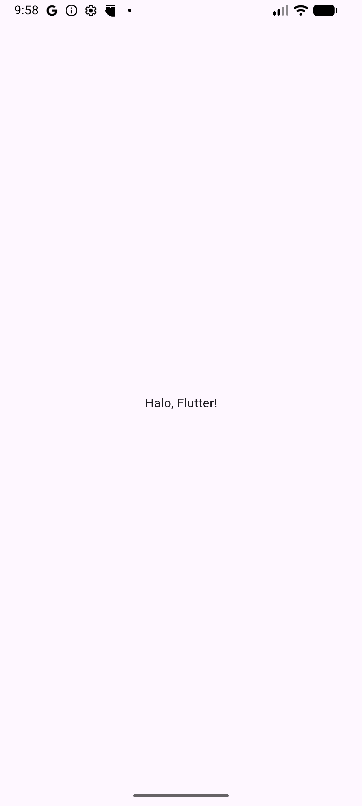
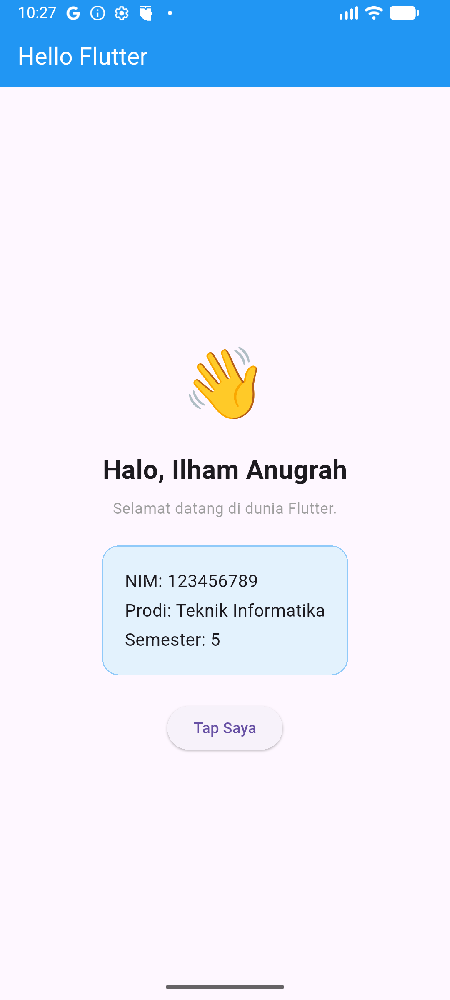

# Praktikum Pertemuan 1 — Hello World & Setup Flutter

## Informasi Umum

| Item | Keterangan |
|------|------------|
| Pertemuan | Minggu 1 (Setup Awal) |
| Topik Kuliah | Pengenalan Flutter, Instalasi Android Studio Panda, Hot Reload |
| Durasi Praktikum | 100 menit |
| Prasyarat | Dart Fundamental |
| Tools | Android Studio Panda + Flutter SDK 3.38.5 |

---

## Kenapa Flutter?

Flutter adalah framework UI dari Google untuk membangun aplikasi **multi-platform dari satu basis kode**: Android, iOS, Web, Windows, macOS, dan Linux. Dibanding alternatifnya, Flutter punya tiga keunggulan praktis yang langsung terasa di praktikum ini:

| Keunggulan | Penjelasan Singkat |
|------------|--------------------|
| **Hot Reload** | Perubahan kode tampil di aplikasi dalam < 1 detik tanpa kehilangan state. Tidak ada lagi "build 2 menit hanya untuk geser tombol 4 piksel". |
| **Single Codebase** | Satu kode Dart → jadi APK Android **dan** IPA iOS. Logika bisnis & UI dipakai bersama. |
| **Widget-based** | Semua di Flutter adalah widget. Konsisten, mudah dipelajari, mudah dikomposisikan. |
| **Performa Native** | Flutter compile ke kode native (ARM/x64), bukan WebView. Animasi 60–120 fps tanpa lag. |

> **Bahasa**: Flutter pakai **Dart**. Sintaksnya mirip Java/JavaScript/TypeScript — kalau sudah pernah ngoding salah satunya, kurva belajarnya landai.

---

## Tujuan Praktikum

Setelah menyelesaikan praktikum ini, mahasiswa mampu:

1. Memastikan Flutter SDK, Android Studio Panda, dan emulator siap pakai
2. Melakukan upgrade Android Studio (Otter → Panda) tanpa kehilangan settings
3. Membuat project Flutter pertama dari **Android Studio GUI Wizard** maupun **CLI**
4. Menjalankan aplikasi di emulator/device dan menggunakan **Hot Reload**
5. Membaca dan memahami struktur project Flutter (folder `lib/`, `pubspec.yaml`)
6. Mengubah aplikasi default menjadi **Hello World** versi sendiri
7. Mengenal widget dasar: `MaterialApp`, `Scaffold`, `Center`, `Text`, `Container`, `Row`, `Column`, `Icon`, `SizedBox`
8. Membedakan **StatelessWidget** dan flow build → render

> Modul ini adalah pintu masuk sebelum membangun aplikasi sungguhan. Fokusnya adalah membiasakan tangan dengan tooling Android Studio dan widget-widget paling dasar.

---

## Gambaran Hasil Akhir

Pada akhir praktikum ini, mahasiswa akan memiliki **2 project**:

1. **`pertemuan_1`** — aplikasi Hello World dengan kartu profil sederhana
2. **`latihan_widget`** — aplikasi tempat eksperimen 4 latihan widget dasar

```
┌──────────────────────────┐
│   ☰  Hello Flutter       │  ← AppBar
├──────────────────────────┤
│                           │
│         👋               │
│                           │
│   Halo, [Nama Anda]!      │
│   Selamat datang di       │
│   dunia Flutter.          │
│                           │
│   ┌──────────────────┐   │
│   │  NIM: 123456789   │   │
│   │  Prodi: TI        │   │
│   │  Semester: 5      │   │
│   └──────────────────┘   │
│                           │
│   [ Tap Saya ]            │
│                           │
└──────────────────────────┘
```

---

## Alur Praktikum

```
Langkah 0          Langkah 1          Langkah 2          Langkah 3
Update Studio  →   Verifikasi    →   Buat Project   →   Pahami
Panda             Environment        Pertama            Default Code

       ↓                                                    ↓
Langkah 5          Langkah 4          (lanjutan)
Latihan       ←   Hello World    ←   Run & Hot Reload
Widget Dasar       Versi Sendiri
```

---

## Langkah 0 — Update Android Studio (Otter → Panda) [Opsional, 10 menit]

Bila sudah punya Android Studio versi sebelumnya (Otter atau lebih lama), upgrade ke Panda **tidak perlu uninstall** terlebih dahulu.

### Langkah:

1. Download installer Android Studio Panda dari [developer.android.com/studio](https://developer.android.com/studio).
2. Buka file `.dmg`, lalu drag icon **Android Studio** ke folder **Applications**.
3. Akan muncul dialog konfirmasi:

   > *"An older item named 'Android Studio' already exists in this location. Do you want to replace it with the newer one you're copying?"*

4. Pilih **Replace** ✅

| Opsi | Efek |
|------|------|
| **Replace** ✅ | Versi lama ditimpa. Settings, plugin (Flutter & Dart), SDK, AVD tetap aman karena tersimpan di `~/Library/Application Support/Google/AndroidStudio*`. **Direkomendasikan.** |
| Keep Both | Dua versi coexist, boros disk ~3-4 GB. Hanya untuk testing. |
| Stop | Batalkan instalasi. |

5. Buka Android Studio Panda → akan muncul dialog **Import Studio settings** → pilih versi sebelumnya → semua plugin & config termigrasi.

6. Pastikan plugin **Flutter** dan **Dart** masih aktif: **Preferences → Plugins → Installed**.

---

## Langkah 1 — Verifikasi Environment (10 menit)

Sebelum menulis kode, pastikan komputer Anda sudah siap. Buka terminal dan jalankan:

```bash
flutter --version
```

Output yang diharapkan:
```
Flutter 3.38.5 • channel stable • https://github.com/flutter/flutter.git
Tools • Dart 3.x.x
```

Cek path Flutter SDK (akan dipakai di Langkah 2):
```bash
which flutter
# /opt/homebrew/bin/flutter

readlink -f $(which flutter) | sed 's|/bin/flutter||'
# /opt/homebrew/share/flutter
```

> **Catatan:** Path SDK tergantung cara instalasi. Untuk Homebrew di macOS: `/opt/homebrew/share/flutter`. Untuk install manual: biasanya `~/development/flutter` atau `~/flutter`.

Lalu jalankan **flutter doctor** untuk memeriksa kelengkapan tooling:

```bash
flutter doctor
```

Pastikan minimal item berikut bertanda ✓ (centang hijau):

| Item | Status yang Dibutuhkan |
|------|------------------------|
| Flutter (Channel stable) | ✓ |
| Android toolchain | ✓ |
| Android Studio (Panda) | ✓ |
| Connected device | ✓ (emulator atau HP fisik) |

> Jika ada item bertanda ✗ atau ! pada Android toolchain, jalankan `flutter doctor --android-licenses` lalu ketik `y` untuk menerima semua lisensi.

### 1.1 Siapkan Emulator atau Device

**Opsi A — Emulator Android (rekomendasi untuk lab):**

1. Buka Android Studio → menu **Tools → Device Manager**
2. Klik **Create Virtual Device** → pilih **Pixel 7** atau **Medium Phone** → Next → pilih image **API 33 / 34** → Finish
3. Klik tombol ▶ untuk menjalankan emulator

**Opsi B — HP Android Fisik:**

1. Aktifkan **Developer Options** (ketuk *Build Number* 7 kali di Settings → About Phone)
2. Aktifkan **USB Debugging**
3. Hubungkan HP ke laptop dengan kabel USB
4. Tap **Allow** ketika dialog "Allow USB debugging" muncul

Verifikasi device terdeteksi:

```bash
flutter devices
```

Harus muncul minimal 1 device, contoh:
```
sdk gphone64 arm64 (mobile) • emulator-5554 • android-arm64 • Android 14 (API 34)
```

---

## Langkah 2 — Membuat Project Flutter Pertama (15 menit)

Ada **dua cara** membuat project Flutter. Pilih salah satu sesuai preferensi.

### 2.A Cara GUI — Lewat Android Studio Wizard (Direkomendasikan untuk Pemula)

1. **Buka wizard:** **File → New → New Project...** (atau klik **New Project** di Welcome screen)

2. **Pilih template Flutter:** di sidebar kiri, scroll ke bagian **Generators** → klik **Flutter**.

3. **Isi Flutter SDK path:**
   ```
   /opt/homebrew/share/flutter
   ```
   Atau klik tombol `...` dan navigasi manual ke folder Flutter SDK Anda.

4. Klik **Next**, lalu isi form konfigurasi project:

| Field | Nilai | Catatan Penting |
|-------|-------|-----------------|
| **Project name** | `pertemuan_1` | Wajib **snake_case**. Tidak boleh ada spasi, dash, atau huruf besar. |
| **Project location** | `~/Documents/Projek/Praktikum/pertemuan_1` | Lokasi penyimpanan. |
| **Description** | `A new Flutter project.` | Bisa diedit nanti di `pubspec.yaml`. |
| **Project type** | `Application` | Untuk app (bukan plugin/package). |
| **Organization** | `com.example` atau domain pribadi | Jadi package ID Android & bundle ID iOS. **Sulit diganti** setelah project dibuat. |
| **Android language** | `Kotlin` ✅ | Standar modern. |
| **Platforms** | Centang **Android & iOS** saja | Linux/MacOS/Web/Windows uncheck dulu untuk mengurangi folder yang tidak perlu. |
| **Create project offline** | Unchecked | Perlu internet untuk download dependency. |

5. Klik **Create**. Android Studio akan menjalankan `flutter create` + `flutter pub get` (1-2 menit).

### 2.B Cara CLI — Lewat Terminal

Pilih folder kerja Anda, buka terminal, lalu:

```bash
cd ~/Documents/Projek/Praktikum
flutter create pertemuan_1
cd pertemuan_1
```

Tunggu sampai prosesnya selesai (~30 detik).

### 2.C Jalankan Aplikasi Default

Pastikan emulator sudah menyala.

**Dari Android Studio (GUI):**
1. Di toolbar atas, ganti dropdown device dari `macOS (desktop)` ke emulator Android (misal **Medium Phone**).
2. Klik tombol ▶️ (Run) hijau atau tekan `Ctrl+R` (Mac) / `Shift+F10` (Windows/Linux).

**Dari terminal:**
```bash
flutter run
```

Tunggu proses build (~1–3 menit pada run pertama). Setelah selesai, muncul aplikasi **Counter** bawaan Flutter:

```
┌──────────────────────────┐
│   Flutter Demo Home Page │
├──────────────────────────┤
│ You have pushed the       │
│ button this many times:   │
│         0                 │
│                  ┌────┐   │
│                  │ +  │   │
│                  └────┘   │
└──────────────────────────┘
```

### 2.D Coba Hot Reload (PENTING!)

Tanpa menutup aplikasi, biarkan run process tetap aktif. Buka file `lib/main.dart`.

Cari baris:
```dart
title: 'Flutter Demo Home Page',
```

Ubah menjadi:
```dart
title: 'Coba Hot Reload!',
```

**Simpan file** (`Cmd+S` / `Ctrl+S`) — di Android Studio, save = otomatis hot reload. Bila pakai terminal `flutter run`, tekan tombol **`r`** (huruf r kecil).

✨ Lihat hasilnya: judul AppBar berubah **dalam waktu < 1 detik tanpa restart**. Itulah Hot Reload.

| Tombol Terminal | Shortcut Android Studio | Fungsi |
|-----------------|-------------------------|--------|
| `r` | `Cmd+S` (auto) atau ⚡ | Hot Reload — refresh kode tanpa kehilangan state |
| `R` | `Cmd+Shift+\` | Hot Restart — restart penuh, state direset |
| `q` | `Cmd+F2` | Quit — hentikan aplikasi |
| `h` | — | Help — daftar shortcut |

> **Aturan tak tertulis:** selama ngoding Flutter, jangan pernah hentikan run process. Semua perubahan UI cukup save → hot reload.

---

## Langkah 3 — Memahami Struktur Project (10 menit)

Buka folder `pertemuan_1` di editor:

```
pertemuan_1/
├── lib/                  ← TEMPAT KITA NGODING (99% kerja di sini)
│   └── main.dart          ← entry point aplikasi
├── android/              ← konfigurasi Android (jarang disentuh)
├── ios/                  ← konfigurasi iOS (jarang disentuh)
├── test/                 ← unit test
├── web/ linux/ macos/ windows/  ← (jika platform diaktifkan)
├── pubspec.yaml          ← daftar dependency & metadata project
├── pubspec.lock          ← versi dependency yang ter-resolve (auto)
├── analysis_options.yaml ← konfigurasi linter Dart
└── .gitignore
```

### 3.1 Bedah `lib/main.dart`

Buka `lib/main.dart`. Kode ~120 baris. Mari bedah bagian utamanya:

```dart
import 'package:flutter/material.dart';   // 1. Import library Material Design

void main() {                              // 2. Entry point — fungsi pertama yang dipanggil
  runApp(const MyApp());                   //    runApp() = "tampilkan widget ini"
}

class MyApp extends StatelessWidget {      // 3. Root widget aplikasi
  const MyApp({super.key});

  @override
  Widget build(BuildContext context) {     // 4. build() = mengembalikan tampilan
    return MaterialApp(                    //    MaterialApp = bungkus tema & navigasi
      title: 'Flutter Demo',
      theme: ThemeData(...),
      home: const MyHomePage(...),         // 5. Halaman pertama yang ditampilkan
    );
  }
}
```

### 3.2 Konsep Kunci

| Konsep | Penjelasan |
|--------|------------|
| **Widget** | Semua di Flutter adalah widget — teks, tombol, padding, bahkan tema |
| **`build()` method** | Method yang mengembalikan widget tree — dipanggil setiap kali UI perlu di-render |
| **`StatelessWidget`** | Widget yang **tidak berubah** setelah dibangun (statis) |
| **`StatefulWidget`** | Widget yang bisa berubah (dipelajari di praktikum berikutnya) |
| **`BuildContext`** | "Lokasi" widget di pohon — dipakai untuk akses tema, navigasi, dll |

### 3.2.1 Flow Build → Render (StatelessWidget)

Apa yang sebenarnya terjadi ketika `runApp()` dipanggil? Inilah alurnya:

```
1. main()                       → fungsi pertama yang dipanggil Dart
       ↓
2. runApp(MyApp())              → Flutter dikasih widget root
       ↓
3. Flutter panggil .build()     → MyApp.build() return MaterialApp
       ↓
4. Build rekursif ke bawah      → MaterialApp.build → Scaffold.build → ...
       ↓
5. Widget tree terbentuk        → struktur logis: "apa yang harus tampil"
       ↓
6. Element tree dibuat          → instans aktual yang dipasang di memori
       ↓
7. Render tree menggambar       → engine Skia/Impeller paint ke layar (60fps)
```

**Kenapa StatelessWidget?**
- "Stateless" = **tidak menyimpan data yang berubah**. Begitu dibuat, tampilannya tetap sampai dihapus.
- Cocok untuk: teks statis, ikon, layout pembungkus, tombol yang tidak punya state internal.
- Kalau widget perlu **berubah** karena interaksi (counter, toggle, input form) → pakai `StatefulWidget` (praktikum berikutnya).

**Aturan emas:**
> Method `build()` bisa dipanggil **berkali-kali** oleh Flutter (misal saat orientasi layar berubah). Jangan lakukan operasi mahal di dalamnya — cukup susun widget dan return.

### 3.3 Bedah `pubspec.yaml`

File ini = `package.json` di JavaScript atau `requirements.txt` di Python.

```yaml
name: pertemuan_1           # nama project
description: A new Flutter project.
version: 1.0.0+1

environment:
  sdk: ^3.0.0               # versi Dart yang dibutuhkan

dependencies:
  flutter:
    sdk: flutter
  cupertino_icons: ^1.0.6   # icon style iOS

dev_dependencies:
  flutter_test:
    sdk: flutter
```

> Setiap kali butuh package baru (misal `http` untuk API), tambahkan di sini lalu jalankan `flutter pub get` (atau klik tombol "Pub get" di Android Studio).

---

## Langkah 4 — Hello World Versi Sendiri (30 menit)

Sekarang **ganti seluruh isi** `lib/main.dart` dengan versi minimal kita sendiri, lalu kembangkan bertahap.

### 4.1 Versi Termurni: Hanya Teks di Tengah Layar

Ganti **seluruh isi** `lib/main.dart` dengan:

```dart
import 'package:flutter/material.dart';

void main() {
  runApp(const MyApp());
}

class MyApp extends StatelessWidget {
  const MyApp({super.key});

  @override
  Widget build(BuildContext context) {
    return MaterialApp(
      debugShowCheckedModeBanner: false,
      home: Scaffold(
        body: Center(
          child: Text('Halo, Flutter!'),
        ),
      ),
    );
  }
}
```

Tekan **Hot Restart** (`Cmd+Shift+\` atau `R` di terminal) — karena mengubah struktur kelas, lebih aman restart.

✅ Hasil: layar putih dengan tulisan "Halo, Flutter!" di tengah.



### Penjelasan Kode

| Baris | Apa yang Terjadi |
|-------|------------------|
| `runApp(const MyApp())` | Memberi tahu Flutter: "ini widget root-ku, tampilkan!" |
| `MaterialApp` | Bungkus aplikasi dengan tema Material Design |
| `debugShowCheckedModeBanner: false` | Hilangkan label "DEBUG" merah di pojok kanan atas |
| `Scaffold` | Kerangka halaman (AppBar, body, FAB, BottomNav) |
| `Center` | Posisikan child-nya tepat di tengah layar |
| `Text('Halo, Flutter!')` | Tampilkan teks |

### 4.2 Tambah AppBar

Ganti `Scaffold` menjadi:

```dart
home: Scaffold(
  appBar: AppBar(
    title: const Text('Hello Flutter'),
    backgroundColor: Colors.blue,
    foregroundColor: Colors.white,
  ),
  body: const Center(
    child: Text('Halo, Flutter!'),
  ),
),
```

Save (hot reload). Sekarang ada bar biru di atas dengan judul "Hello Flutter".

### 4.3 Styling Teks

Ubah `Text('Halo, Flutter!')` menjadi:

```dart
const Text(
  'Halo, Flutter!',
  style: TextStyle(
    fontSize: 32,
    fontWeight: FontWeight.bold,
    color: Colors.blue,
  ),
),
```

Hot reload. Teks sekarang besar, tebal, dan biru.

### 4.4 Layout Vertikal dengan Column

Ganti `body` menjadi:

```dart
body: Center(
  child: Column(
    mainAxisAlignment: MainAxisAlignment.center,
    children: [
      const Text('👋', style: TextStyle(fontSize: 64)),
      const SizedBox(height: 16),
      const Text(
        'Halo, [Nama Anda]!',
        style: TextStyle(fontSize: 24, fontWeight: FontWeight.bold),
      ),
      const SizedBox(height: 8),
      const Text(
        'Selamat datang di dunia Flutter.',
        style: TextStyle(fontSize: 14, color: Colors.grey),
      ),
    ],
  ),
),
```

> **Ganti `[Nama Anda]` dengan nama Anda sebenarnya!**

Hot reload. Sekarang ada emoji 👋 di atas, nama Anda di bawahnya, lalu kalimat sambutan.

### 4.5 Kartu Profil dengan Container

Setelah `SizedBox(height: 8)` terakhir, tambahkan:

```dart
const SizedBox(height: 24),
Container(
  margin: const EdgeInsets.symmetric(horizontal: 32),
  padding: const EdgeInsets.all(20),
  decoration: BoxDecoration(
    color: Colors.blue.shade50,
    borderRadius: BorderRadius.circular(16),
    border: Border.all(color: Colors.blue.shade200),
  ),
  child: const Column(
    crossAxisAlignment: CrossAxisAlignment.start,
    children: [
      Text('NIM: 123456789', style: TextStyle(fontSize: 16)),
      SizedBox(height: 4),
      Text('Prodi: Teknik Informatika', style: TextStyle(fontSize: 16)),
      SizedBox(height: 4),
      Text('Semester: 5', style: TextStyle(fontSize: 16)),
    ],
  ),
),
```

> **Ganti NIM, Prodi, dan Semester** sesuai data Anda.

### 4.6 Tambah Tombol

Setelah Container kartu profil, tambahkan:

```dart
const SizedBox(height: 24),
ElevatedButton(
  onPressed: () {
    // Belum dipakai — akan dipelajari di praktikum berikutnya
  },
  child: const Text('Tap Saya'),
),
```

Hot reload. Selamat — Anda baru saja membangun Hello World versi sendiri! 🎉

### 4.7 Kode Lengkap `lib/main.dart`

```dart
import 'package:flutter/material.dart';

void main() {
  runApp(const MyApp());
}

class MyApp extends StatelessWidget {
  const MyApp({super.key});

  @override
  Widget build(BuildContext context) {
    return MaterialApp(
      debugShowCheckedModeBanner: false,
      home: Scaffold(
        appBar: AppBar(
          title: const Text('Hello Flutter'),
          backgroundColor: Colors.blue,
          foregroundColor: Colors.white,
        ),
        body: Center(
          child: Column(
            mainAxisAlignment: MainAxisAlignment.center,
            children: [
              const Text('👋', style: TextStyle(fontSize: 64)),
              const SizedBox(height: 16),
              const Text(
                'Halo, [Nama Anda]!',
                style: TextStyle(fontSize: 24, fontWeight: FontWeight.bold),
              ),
              const SizedBox(height: 8),
              const Text(
                'Selamat datang di dunia Flutter.',
                style: TextStyle(fontSize: 14, color: Colors.grey),
              ),
              const SizedBox(height: 24),
              Container(
                margin: const EdgeInsets.symmetric(horizontal: 32),
                padding: const EdgeInsets.all(20),
                decoration: BoxDecoration(
                  color: Colors.blue.shade50,
                  borderRadius: BorderRadius.circular(16),
                  border: Border.all(color: Colors.blue.shade200),
                ),
                child: const Column(
                  crossAxisAlignment: CrossAxisAlignment.start,
                  children: [
                    Text('NIM: 123456789', style: TextStyle(fontSize: 16)),
                    SizedBox(height: 4),
                    Text('Prodi: Teknik Informatika',
                        style: TextStyle(fontSize: 16)),
                    SizedBox(height: 4),
                    Text('Semester: 5', style: TextStyle(fontSize: 16)),
                  ],
                ),
              ),
              const SizedBox(height: 24),
              ElevatedButton(
                onPressed: () {},
                child: const Text('Tap Saya'),
              ),
            ],
          ),
        ),
      ),
    );
  }
}
```



### Diagram Widget Tree

```
MaterialApp
└── Scaffold
    ├── AppBar
    │   └── Text ("Hello Flutter")
    └── body: Center
        └── Column
            ├── Text ("👋")
            ├── SizedBox
            ├── Text ("Halo, [Nama]!")
            ├── SizedBox
            ├── Text ("Selamat datang...")
            ├── SizedBox
            ├── Container (kartu profil biru)
            │   └── Column
            │       ├── Text (NIM)
            │       ├── Text (Prodi)
            │       └── Text (Semester)
            ├── SizedBox
            └── ElevatedButton
                └── Text ("Tap Saya")
```

---

## Langkah 5 — Latihan Widget Dasar (40 menit)

Hentikan run process, lalu **buat project kedua** untuk eksperimen widget. Project ini terpisah agar kode Hello World tetap rapi.

```bash
cd ~/Documents/Projek/Praktikum
flutter create latihan_widget
cd latihan_widget
flutter run
```

Atau bisa juga lewat **File → New → New Flutter Project** di Android Studio.

Empat latihan berikut adalah **drill widget dasar**. Untuk setiap latihan, **ganti seluruh isi `lib/main.dart`** dengan kode yang diberikan, hot restart, amati hasilnya, lalu **eksperimen** sesuai instruksi.

### Latihan 1: Text & Styling

```dart
import 'package:flutter/material.dart';

void main() {
  runApp(const MaterialApp(
    debugShowCheckedModeBanner: false,
    home: Scaffold(
      body: Center(
        child: Column(
          mainAxisAlignment: MainAxisAlignment.center,
          children: [
            Text(
              'Hello Flutter!',
              style: TextStyle(
                fontSize: 28,
                fontWeight: FontWeight.bold,
                color: Colors.blue,
              ),
            ),
            SizedBox(height: 8),
            Text(
              'Ini teks biasa dengan ukuran kecil',
              style: TextStyle(fontSize: 14, color: Colors.grey),
            ),
          ],
        ),
      ),
    ),
  ));
}
```

🎯 **Eksperimen:**
- Ubah `fontSize` ke 40, lalu ke 12 — apa yang terjadi?
- Ganti `FontWeight.bold` ke `FontWeight.w300` (tipis), `w900` (sangat tebal)
- Ganti `Colors.blue` ke `Colors.red`, `Colors.deepPurple`, `Color(0xFF2196F3)`
- Tambahkan property `letterSpacing: 2` di TextStyle pertama

### Latihan 2: Container & Decoration

```dart
import 'package:flutter/material.dart';

void main() {
  runApp(MaterialApp(
    debugShowCheckedModeBanner: false,
    home: Scaffold(
      body: Center(
        child: Container(
          width: 200,
          height: 200,
          padding: const EdgeInsets.all(20),
          decoration: BoxDecoration(
            color: Colors.blue,
            borderRadius: BorderRadius.circular(20),
            boxShadow: [
              BoxShadow(
                color: Colors.blue.withValues(alpha: 0.3),
                blurRadius: 20,
                offset: const Offset(0, 10),
              ),
            ],
          ),
          child: const Center(
            child: Text(
              'Box',
              style: TextStyle(color: Colors.white, fontSize: 24),
            ),
          ),
        ),
      ),
    ),
  ));
}
```

🎯 **Eksperimen:**
- Ubah `width` dan `height` ke nilai berbeda (misal 300x100)
- Ganti `BorderRadius.circular(20)` menjadi `BorderRadius.circular(100)` — bentuk apa yang muncul?
- Ubah `blurRadius: 20` ke `blurRadius: 50` — perhatikan bayangannya
- Tambahkan `border: Border.all(color: Colors.black, width: 4)` di dalam BoxDecoration

> 💡 **Insight:** Container = "kotak ajaib" Flutter. Hampir semua kartu, tombol custom, dan bingkai dibuat dari Container.

### Latihan 3: Row & Column

```dart
import 'package:flutter/material.dart';

void main() {
  runApp(const MaterialApp(
    debugShowCheckedModeBanner: false,
    home: Scaffold(
      body: Center(
        child: Column(
          mainAxisAlignment: MainAxisAlignment.center,
          children: [
            Text('Baris di bawah ini menggunakan Row:'),
            SizedBox(height: 16),
            Row(
              mainAxisAlignment: MainAxisAlignment.spaceEvenly,
              children: [
                _Kotak(color: Colors.red),
                _Kotak(color: Colors.green),
                _Kotak(color: Colors.blue),
              ],
            ),
            SizedBox(height: 16),
            Text('Column = vertikal ↕'),
            Text('Row = horizontal ↔'),
          ],
        ),
      ),
    ),
  ));
}

class _Kotak extends StatelessWidget {
  final Color color;
  const _Kotak({required this.color});

  @override
  Widget build(BuildContext context) {
    return Container(width: 60, height: 60, color: color);
  }
}
```

🎯 **Eksperimen — `MainAxisAlignment`:**

Ganti `MainAxisAlignment.spaceEvenly` di Row dengan setiap nilai berikut, hot reload tiap kali:

| Nilai | Pengaruh |
|-------|----------|
| `.start` | Tumpuk di kiri |
| `.center` | Tumpuk di tengah |
| `.end` | Tumpuk di kanan |
| `.spaceBetween` | Pertama di kiri, terakhir di kanan, sisa di tengah |
| `.spaceAround` | Jarak di tepi = 1/2 jarak antar kotak |
| `.spaceEvenly` | Semua jarak sama rata |

> 💡 **Bonus:** ada saudaranya `crossAxisAlignment` untuk sumbu tegak lurus. Coba tambahkan di Row dan ubah-ubah nilainya.

### Latihan 4: Icon & Bottom Bar Mock-up

```dart
import 'package:flutter/material.dart';

void main() {
  runApp(MaterialApp(
    debugShowCheckedModeBanner: false,
    home: Scaffold(
      appBar: AppBar(title: const Text('Latihan Icon')),
      body: const Center(
        child: Text('Lihat ikon-ikon di bawah 👇'),
      ),
      bottomNavigationBar: Container(
        padding: const EdgeInsets.symmetric(vertical: 12),
        color: Colors.grey.shade100,
        child: const Row(
          mainAxisAlignment: MainAxisAlignment.spaceEvenly,
          children: [
            Icon(Icons.home, size: 32, color: Colors.blue),
            Icon(Icons.receipt_long, size: 32, color: Colors.grey),
            Icon(Icons.leaderboard, size: 32, color: Colors.grey),
            Icon(Icons.settings, size: 32, color: Colors.grey),
          ],
        ),
      ),
    ),
  ));
}
```

🎯 **Eksperimen:**
- Buka [https://fonts.google.com/icons](https://fonts.google.com/icons) — pilih 4 ikon yang Anda suka, ganti `Icons.home`, `Icons.receipt_long`, dst dengan nama ikonnya (semua huruf kecil + underscore)
- Ubah `size: 32` ke ukuran berbeda (24, 48, 64)
- Ganti warna ikon pertama menjadi merah, kedua hijau, ketiga ungu

---

## Ringkasan Widget Dasar

| Widget | Fungsi | Analogi |
|--------|--------|---------|
| `MaterialApp` | Bungkus aplikasi (tema, navigasi) | Wrapper aplikasi |
| `Scaffold` | Kerangka halaman (AppBar, body, FAB) | Template HTML |
| `AppBar` | Bar judul di atas | Header |
| `Center` | Posisikan child di tengah | Align center |
| `Column` | Susun vertikal ↕ | VerticalArrangement (Kodular) |
| `Row` | Susun horizontal ↔ | HorizontalArrangement (Kodular) |
| `Container` | Kotak dengan dekorasi | Div + CSS |
| `Text` | Menampilkan teks | Label |
| `Icon` | Menampilkan ikon | Image bawaan |
| `SizedBox` | Jarak/spacer | Margin/padding sederhana |
| `ElevatedButton` | Tombol terangkat | Button |

---

## Tugas Mandiri

Selesaikan **dalam project `pertemuan_1`** (bukan `latihan_widget`). Modifikasi `lib/main.dart` agar:

1. **Ganti emoji 👋** dengan emoji lain yang merepresentasikan Anda (misal 🎓, 🚀, 🐱)
2. **Tambahkan baris ke-4** di kartu profil: `Hobi: ...`
3. **Ganti warna AppBar** menjadi warna favorit Anda (boleh pakai `Color(0xFF......)` dari [coolors.co](https://coolors.co))
4. **Tambahkan kartu profil kedua** di bawah kartu pertama, isinya 3 hal yang ingin Anda pelajari di mata kuliah ini
5. **Bonus:** ganti `ElevatedButton` menjadi `OutlinedButton`, lalu coba `FilledButton` — apa bedanya?

---

## Checklist Sebelum Pulang

- [ ] Android Studio Panda berhasil terinstall (atau upgrade dari Otter)
- [ ] `flutter doctor` tidak menunjukkan error fatal
- [ ] Emulator atau HP fisik berhasil terdeteksi via `flutter devices`
- [ ] Project `pertemuan_1` berjalan dan menampilkan kartu profil dengan data Anda
- [ ] Hot reload terbukti bekerja — perubahan teks tampil instan
- [ ] Hot restart terbukti bekerja
- [ ] 4 latihan widget di project `latihan_widget` sudah dicoba, minimal 1 eksperimen per latihan
- [ ] Tugas mandiri 1–4 selesai di `pertemuan_1`

---

## Troubleshooting Umum

| Masalah | Solusi |
|---------|--------|
| Dialog "Replace / Keep Both / Stop" muncul saat install Panda | Pilih **Replace** — settings & plugin tetap aman |
| `flutter: command not found` | Tambahkan path Flutter SDK ke `PATH` di `.zshrc`/`.bashrc` |
| Field "Flutter SDK path" kosong di wizard | Isi `/opt/homebrew/share/flutter` (Homebrew) atau path manual install Anda |
| Plugin Flutter tidak muncul setelah upgrade Studio | **Preferences → Plugins → Marketplace** → install ulang Flutter & Dart |
| `No connected devices` | Jalankan emulator dulu, atau colok HP & enable USB Debugging |
| `Gradle build failed` | Jalankan `flutter clean` lalu `flutter run` ulang |
| `Android Gradle Plugin version ... is lower than Flutter's minimum supported version` | Lihat **Lampiran B — Update Gradle & AGP** |
| `Flutter support for your project's Gradle version (8.x.x) will soon be dropped` | Naikkan Gradle wrapper, lihat **Lampiran B** |
| `Unsupported class file major version XX` saat build | JDK terlalu baru/lama. Set JDK 17 di Android Studio: **Preferences → Build → Build Tools → Gradle → Gradle JDK** |
| Emoji tampil sebagai kotak ☐ | Normal di emulator versi lama — coba di HP fisik |
| Hot reload tidak bekerja setelah ubah `class` | Pakai Hot Restart (`Cmd+Shift+\` / `R`) bukan Hot Reload |
| Layar putih saja, tidak ada apa-apa | Cek terminal/Run console — biasanya ada exception merah, baca pesannya |
| Target device masih `macOS (desktop)` | Klik dropdown device di toolbar atas, ganti ke emulator Android |

---

## Preview Praktikum 2 (Minggu Depan)

Minggu depan kita mulai membangun aplikasi sungguhan. Skill yang baru saja Anda kuasai (`Scaffold`, `Column`, `Row`, `Container`, `Text`, `Icon`) akan langsung dipakai untuk membangun **halaman Dashboard** lengkap dengan kartu informasi dan daftar item.

> Jangan hapus project `pertemuan_1` dan `latihan_widget` — keduanya jadi referensi pribadi Anda saat ada widget yang lupa cara pakainya.

---

## Lampiran A — Cheatsheet Shortcut Android Studio

| Aksi | macOS | Windows/Linux |
|------|-------|---------------|
| Run | `Ctrl + R` | `Shift + F10` |
| Hot Reload | `Cmd + S` (auto saat save) | `Ctrl + S` |
| Hot Restart | `Cmd + Shift + \` | `Ctrl + Shift + \` |
| Stop Run | `Cmd + F2` | `Ctrl + F2` |
| Format kode | `Cmd + Option + L` | `Ctrl + Alt + L` |
| Cari file | `Cmd + Shift + O` | `Ctrl + Shift + N` |
| Cari simbol/class | `Cmd + Option + O` | `Ctrl + Alt + Shift + N` |
| Cari di semua tempat | `Shift + Shift` (double shift) | `Shift + Shift` |
| Auto-import | `Option + Enter` | `Alt + Enter` |
| Bungkus widget (Wrap with…) | `Option + Enter` di nama widget | `Alt + Enter` |
| Rename simbol | `Shift + F6` | `Shift + F6` |
| Pindah baris ke atas/bawah | `Cmd + Shift + ↑/↓` | `Ctrl + Shift + ↑/↓` |
| Duplikasi baris | `Cmd + D` | `Ctrl + D` |
| Komentar baris | `Cmd + /` | `Ctrl + /` |

> **Pro tip:** `Option + Enter` (Mac) di nama widget → "Wrap with Center / Padding / Column / Container" — fitur paling sering dipakai saat menyusun layout.

---

## Lampiran B — Update Gradle & AGP

Project Flutter lama kadang error karena versi Gradle / Android Gradle Plugin (AGP) di bawah minimum Flutter terbaru. Gejala umum:

```
Error: Your project's Android Gradle Plugin version (8.1.0) is lower than
Flutter's minimum supported version of Android Gradle Plugin version 8.1.1.
```

### B.1 Cek versi sekarang

| File | Versi yang dicek | Lokasi baris |
|------|------------------|--------------|
| `android/gradle/wrapper/gradle-wrapper.properties` | Gradle | `distributionUrl=...gradle-X.Y-all.zip` |
| `android/settings.gradle` | AGP | `id "com.android.application" version "X.Y.Z"` |
| `android/build.gradle` (project lama) | AGP | `classpath 'com.android.tools.build:gradle:X.Y.Z'` |

### B.2 Versi yang aman dipakai (per April 2026)

| Komponen | Versi Minimum | Versi Direkomendasikan |
|----------|---------------|------------------------|
| Gradle | 8.7 | **8.9** |
| AGP | 8.1.1 | **8.3.0** |
| Kotlin | 1.8.22 | **1.9.22** |
| JDK | 17 | **17** |

### B.3 Langkah perbaikan

1. **Edit `android/settings.gradle`** — naikkan AGP:
   ```gradle
   plugins {
       id "dev.flutter.flutter-plugin-loader" version "1.0.0"
       id "com.android.application" version "8.3.0" apply false
       id "org.jetbrains.kotlin.android" version "1.9.22" apply false
   }
   ```

2. **Edit `android/gradle/wrapper/gradle-wrapper.properties`** — naikkan Gradle:
   ```
   distributionUrl=https\://services.gradle.org/distributions/gradle-8.9-all.zip
   ```

3. **Bersihkan & run ulang:**
   ```bash
   flutter clean
   flutter pub get
   flutter run
   ```

> **Catatan:** Run pertama setelah ganti versi akan men-download Gradle distribusi baru (~150 MB). Sabar.

### B.4 Quick bypass (sementara)

Kalau lagi buru-buru dan belum mau update versi:

```bash
flutter run --android-skip-build-dependency-validation
```

> ⚠️ Bypass ini **bukan solusi jangka panjang** — versi tetap harus dinaikkan sebelum project dipakai serius (apalagi sebelum publikasi ke Play Store).

---

## Referensi

- [Flutter Official Docs](https://docs.flutter.dev/)
- [Dart Language Tour](https://dart.dev/language)
- [Material 3 Design](https://m3.material.io/)
- [DartPad (online editor)](https://dartpad.dev/)
- [Material Icons Catalog](https://fonts.google.com/icons)
- [Coolors — Color Palette Generator](https://coolors.co)
