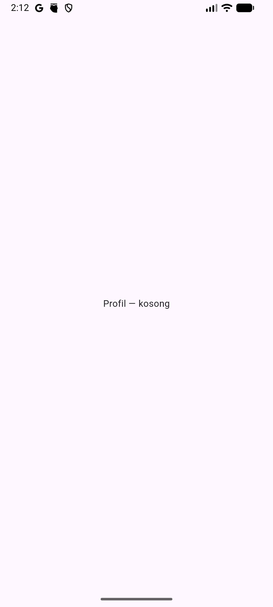
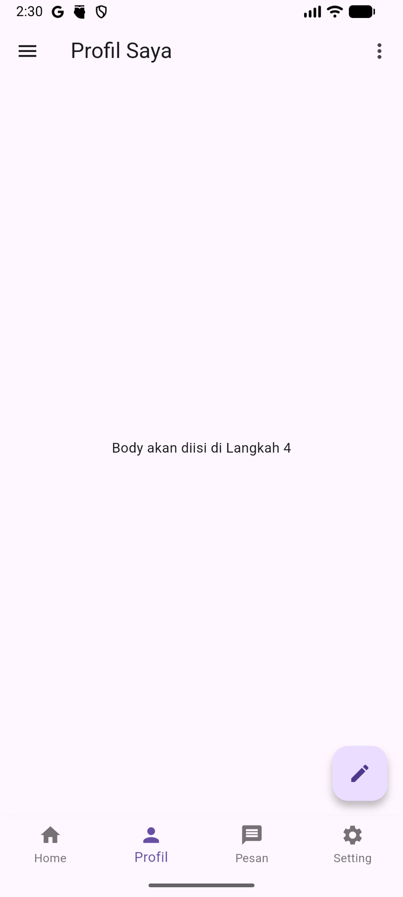
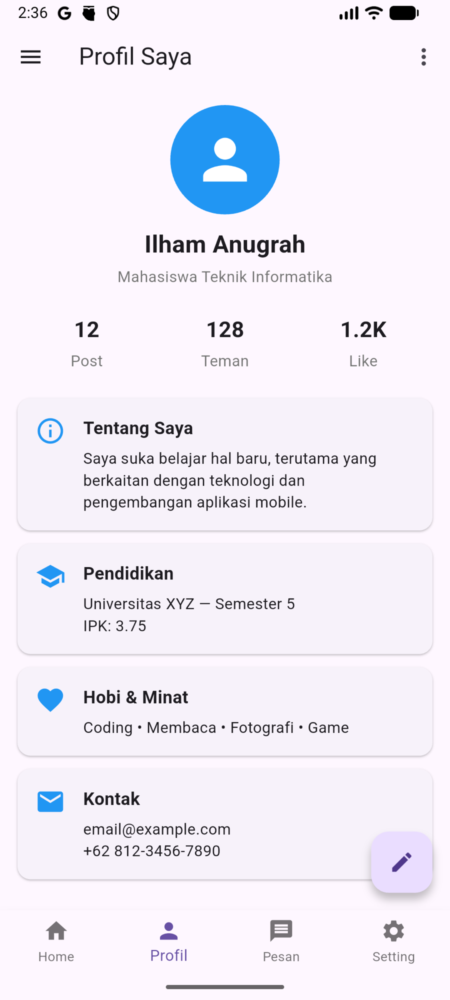

# Praktikum Pertemuan 2 — Anatomi Scaffold & Komponen Flutter

## Informasi Umum

| Item             | Keterangan                                        |
| ---------------- | ------------------------------------------------- |
| Pertemuan        | Minggu 2 (Lanjutan setelah Hello World & Setup)   |
| Topik Kuliah     | Anatomi halaman Flutter & katalog widget esensial |
| Durasi Praktikum | 100 menit                                         |
| Prasyarat        | Pertemuan 1 (Hello World & Setup Flutter) selesai |

---

## Tujuan Praktikum

Setelah menyelesaikan praktikum ini, mahasiswa mampu:

1. Memahami **anatomi `Scaffold`** dan slot-slotnya (`appBar`, `body`, `bottomNavigationBar`, `floatingActionButton`, `drawer`)
2. Membedakan **padding vs margin**, kapan pakai `Expanded`/`Flexible`, dan kapan pakai `SizedBox`
3. Membuat halaman yang **bisa di-scroll** dengan `SingleChildScrollView` & `ListView`
4. Mengenal kategori widget Flutter: **Display, Input, Button, Feedback, Layout-helper**
5. Membangun **Profile Page** lengkap yang memanfaatkan semua slot `Scaffold`
6. Punya "kamus pribadi" widget gallery untuk referensi di praktikum-praktikum berikutnya

> Modul ini adalah **jembatan** antara Hello World (Pertemuan 1) dan pembangunan Dashboard aplikasi sungguhan di pertemuan berikutnya. Di sini kita memperdalam komponen-komponen Flutter agar saat masuk ke aplikasi sungguhan, Anda tidak bingung memilih widget.

---

## Gambaran Hasil Akhir

Pada akhir praktikum ini, mahasiswa akan punya **1 project** (`profile_page`) yang berisi **dua bagian**:

1. **Profile Page** — halaman profil dengan `Scaffold` lengkap: AppBar, Drawer, FAB, BottomNavigationBar, body yang bisa di-scroll
2. **Widget Gallery** — katalog widget berisi 5 halaman kategori (Display, Input, Button, Feedback, Layout) yang diakses dari **Drawer** halaman profil

```
┌──────────────────────────┐
│ ☰  Profil Saya       ⋮  │  ← AppBar (dengan drawer & action)
├──────────────────────────┤
│      ╭──────────╮          │
│      │   foto   │          │  ← CircleAvatar
│      ╰──────────╯          │
│      Ilham A.              │
│      Mahasiswa TI          │
│  ─────────────────────     │
│  ▸ Tentang Saya             │  ← Section (Card)
│  ▸ Pendidikan               │
│  ▸ Hobi & Minat             │
│  ▸ Kontak                   │
│        ...scrollable...     │
├──────────────────────────┤
│            ┌────┐          │
│            │ ✏  │          │  ← FloatingActionButton
│            └────┘          │
├──────────────────────────┤
│  🏠     👤     📨      ⚙  │  ← BottomNavigationBar
└──────────────────────────┘
```

---

## Alur Praktikum

```
Langkah 1        Langkah 2         Langkah 3          Langkah 4         Langkah 5
Setup       →   Anatomi       →   Layout         →   Bangun        →   Widget
Project          Scaffold          Fundamental         Profile Page      Gallery
(5')             (20')             (20')               (25')             (30')
```

---

## Langkah 1 — Setup Project Profile Page (5 menit)

Buka folder kerja Anda (`~/Documents/flutter_workspace/`) di terminal, lalu:

```bash
flutter create profile_page
cd profile_page
flutter run
```

Pastikan aplikasi default (counter) muncul. Buka `lib/main.dart`, **hapus seluruh isinya**, ganti dengan template kosong berikut:

```dart
import 'package:flutter/material.dart';

void main() {
  runApp(const MyApp());
}

class MyApp extends StatelessWidget {
  const MyApp({super.key});

  @override
  Widget build(BuildContext context) {
    return const MaterialApp(
      debugShowCheckedModeBanner: false,
      home: ProfilePage(),
    );
  }
}

class ProfilePage extends StatelessWidget {
  const ProfilePage({super.key});

  @override
  Widget build(BuildContext context) {
    return const Scaffold(
      body: Center(child: Text('Profil — kosong')),
    );
  }
}
```

Hot restart (`R`). Layar putih dengan tulisan "Profil — kosong". Kanvas siap — sekarang mari isi `Scaffold` slot demi slot.



---

## Langkah 2 — Anatomi Scaffold (20 menit)

`Scaffold` adalah **kerangka halaman** standar Material Design. Bayangkan seperti template HTML — slot-slotnya sudah disediakan, tinggal isi.

### 2.1 Slot-slot Scaffold

```
┌──────────────────────────────────┐
│            appBar                │  ← bar atas (judul + actions)
├──────────────────────────────────┤
│                                  │
│          body                    │  ← isi utama halaman
│        (scrollable area)         │
│                                  │
│                                  │
│                            ┌──┐  │
│                            │FAB│ │  ← floatingActionButton
│                            └──┘  │
├──────────────────────────────────┤
│      bottomNavigationBar         │  ← nav bawah
└──────────────────────────────────┘

drawer = panel samping (slide dari kiri saat ☰ ditekan)
endDrawer = panel samping kanan
```

| Slot                   | Fungsi              | Contoh Pakai                       |
| ---------------------- | ------------------- | ---------------------------------- |
| `appBar`               | Bar atas            | Judul halaman, tombol back, action |
| `body`                 | Isi utama           | Konten halaman                     |
| `floatingActionButton` | Tombol melayang     | Tambah data, aksi utama            |
| `bottomNavigationBar`  | Tab bar bawah       | Navigasi antar halaman utama       |
| `drawer`               | Panel samping kiri  | Menu, profil, pengaturan           |
| `endDrawer`            | Panel samping kanan | Filter, notifikasi                 |
| `backgroundColor`      | Warna latar         | Tema halaman                       |

### 2.2 Isi Slot Satu per Satu

Ganti `ProfilePage.build()` menjadi:

```dart
@override
Widget build(BuildContext context) {
  return Scaffold(
    appBar: AppBar(
      title: const Text('Profil Saya'),
      actions: [
        IconButton(
          icon: const Icon(Icons.more_vert),
          onPressed: () {},
        ),
      ],
    ),
    drawer: Drawer(
      child: ListView(
        children: const [
          DrawerHeader(
            decoration: BoxDecoration(color: Colors.blue),
            child: Text(
              'Menu',
              style: TextStyle(color: Colors.white, fontSize: 24),
            ),
          ),
          ListTile(leading: Icon(Icons.home), title: Text('Beranda')),
          ListTile(leading: Icon(Icons.person), title: Text('Profil')),
          ListTile(leading: Icon(Icons.settings), title: Text('Pengaturan')),
        ],
      ),
    ),
    body: const Center(child: Text('Body akan diisi di Langkah 4')),
    floatingActionButton: FloatingActionButton(
      onPressed: () {},
      child: const Icon(Icons.edit),
    ),
    bottomNavigationBar: BottomNavigationBar(
      currentIndex: 1,
      type: BottomNavigationBarType.fixed,
      items: const [
        BottomNavigationBarItem(icon: Icon(Icons.home), label: 'Home'),
        BottomNavigationBarItem(icon: Icon(Icons.person), label: 'Profil'),
        BottomNavigationBarItem(icon: Icon(Icons.message), label: 'Pesan'),
        BottomNavigationBarItem(icon: Icon(Icons.settings), label: 'Setting'),
      ],
      onTap: (i) {},
    ),
  );
}
```

Hot restart (`R`).

✅ Sekarang Anda bisa lihat:

- AppBar biru di atas dengan judul + ikon ⋮
- Tombol ☰ di kiri AppBar — tap → drawer slide dari kiri
- Tombol ✏ FAB di kanan bawah
- 4 tab navigasi di paling bawah



🎯 **Eksperimen:**

1. Ganti `Icons.more_vert` jadi `Icons.search` di action AppBar
2. Tambahkan 1 `ListTile` lagi di drawer (misal "Tentang")
3. Ubah `currentIndex: 1` jadi `0`, `2`, `3` — perhatikan tab mana yang ter-highlight
4. Ganti `FloatingActionButton` jadi `FloatingActionButton.extended(onPressed: () {}, label: const Text('Edit'), icon: const Icon(Icons.edit))`

> 💡 **Insight:** Anda **tidak harus** mengisi semua slot. Halaman bisa cuma punya `appBar` + `body`. Tambah slot lain hanya jika halaman butuh.

---

## Langkah 3 — Layout Fundamental (20 menit)

Sebelum mengisi `body`, pahami 4 konsep layout yang paling sering bikin pemula bingung.

### 3.1 Padding vs Margin

| Konsep      | Letak                                             | Cara di Flutter                                            |
| ----------- | ------------------------------------------------- | ---------------------------------------------------------- |
| **Padding** | Jarak **dalam** widget (antara border ke isi)     | `padding:` di `Container`, atau widget `Padding()`         |
| **Margin**  | Jarak **luar** widget (antara widget ke tetangga) | `margin:` di `Container`, atau `SizedBox` di antara widget |

```
┌────────────────────────────┐  ← border Container
│ margin (luar)              │
│  ┌──────────────────────┐  │
│  │ padding (dalam)      │  │
│  │  ┌────────────────┐  │  │
│  │  │  isi widget    │  │  │
│  │  └────────────────┘  │  │
│  └──────────────────────┘  │
└────────────────────────────┘
```

**Aturan praktis:**

- Mau jarak antar elemen vertikal? → `SizedBox(height: X)`
- Mau "ruang nafas" di dalam Card? → `padding: EdgeInsets.all(X)`
- Mau menggeser widget dari tepi layar? → `padding` pada parent atau `margin` pada widget itu

### 3.2 Expanded vs Flexible vs SizedBox

Ketiganya untuk **mengatur ukuran child di Row/Column**.

```dart
// Contoh — paste sementara di body untuk eksplorasi
Row(
  children: [
    Container(width: 80, height: 80, color: Colors.red),     // fixed 80px
    Expanded(child: Container(height: 80, color: Colors.green)), // sisa ruang
    SizedBox(width: 16),                                      // jarak tetap
    Container(width: 80, height: 80, color: Colors.blue),    // fixed 80px
  ],
)
```

| Widget                      | Kapan Pakai                                                              |
| --------------------------- | ------------------------------------------------------------------------ |
| `Expanded`                  | Anak harus mengisi **sisa ruang** parent (Row/Column)                    |
| `Flexible`                  | Mirip Expanded tapi child boleh **lebih kecil** dari ruang yang tersedia |
| `SizedBox(width/height: X)` | **Jarak/spacer** dengan ukuran tetap                                     |
| `Container(width: X)`       | Ukuran tetap **dengan dekorasi** (warna, border, dst)                    |

> ⚠️ **Error klasik:** `Row` + child terlalu lebar → "RIGHT OVERFLOWED BY X PIXELS". Solusi: bungkus salah satu child dengan `Expanded` atau `Flexible`.

### 3.3 Membuat Body yang Bisa Di-Scroll

Default `Column` **tidak bisa di-scroll**. Kalau isi melebihi tinggi layar → overflow error.

**3 opsi scrolling:**

```dart
// Opsi 1: SingleChildScrollView — bungkus Column yang isinya tetap
SingleChildScrollView(
  child: Column(
    children: [/* widget tetap */],
  ),
)

// Opsi 2: ListView — daftar item yang panjangnya tidak diketahui
ListView(
  children: [/* item-item */],
)

// Opsi 3: ListView.builder — daftar dari data dinamis (lazy build)
ListView.builder(
  itemCount: dataList.length,
  itemBuilder: (context, index) => ListTile(title: Text(dataList[index])),
)
```

| Pilihan                            | Kapan Pakai                                                                |
| ---------------------------------- | -------------------------------------------------------------------------- |
| `SingleChildScrollView` + `Column` | Halaman tidak terlalu panjang, child beragam jenis (banner, kartu, tombol) |
| `ListView`                         | Daftar item homogen, jumlah sedang                                         |
| `ListView.builder`                 | Daftar dari array/database, jumlah besar (efisien)                         |

Di pertemuan berikutnya kita akan pakai `ListView` untuk daftar transaksi — jadi pastikan konsep ini paham.

### 3.4 EdgeInsets — 4 Cara Atur Padding/Margin

```dart
EdgeInsets.all(16)                            // semua sisi 16
EdgeInsets.symmetric(horizontal: 24, vertical: 8) // kiri-kanan 24, atas-bawah 8
EdgeInsets.only(left: 16, top: 8)             // pilih sisi tertentu
EdgeInsets.fromLTRB(16, 8, 16, 24)            // left, top, right, bottom
```

---

## Langkah 4 — Bangun Body Profile Page (25 menit)

Sekarang isi `body` dengan konten profil yang bisa di-scroll. Ganti `body:` menjadi:

```dart
body: SingleChildScrollView(
  padding: const EdgeInsets.all(16),
  child: Column(
    crossAxisAlignment: CrossAxisAlignment.stretch,
    children: [
      // === HEADER PROFIL ===
      Center(
        child: Column(
          children: [
            const CircleAvatar(
              radius: 50,
              backgroundColor: Colors.blue,
              child: Icon(Icons.person, size: 60, color: Colors.white),
            ),
            const SizedBox(height: 12),
            const Text(
              'Ilham Anugrah',
              style: TextStyle(fontSize: 22, fontWeight: FontWeight.bold),
            ),
            const SizedBox(height: 4),
            Text(
              'Mahasiswa Teknik Informatika',
              style: TextStyle(fontSize: 14, color: Colors.grey.shade600),
            ),
          ],
        ),
      ),

      const SizedBox(height: 24),

      // === BARIS STATISTIK (Row + Expanded) ===
      Row(
        children: [
          Expanded(child: _StatBox(label: 'Post', value: '12')),
          Expanded(child: _StatBox(label: 'Teman', value: '128')),
          Expanded(child: _StatBox(label: 'Like', value: '1.2K')),
        ],
      ),

      const SizedBox(height: 24),

      // === SECTION CARD ===
      _SectionCard(
        icon: Icons.info_outline,
        title: 'Tentang Saya',
        content: 'Saya suka belajar hal baru, terutama yang berkaitan '
            'dengan teknologi dan pengembangan aplikasi mobile.',
      ),
      _SectionCard(
        icon: Icons.school,
        title: 'Pendidikan',
        content: 'Universitas XYZ — Semester 5\nIPK: 3.75',
      ),
      _SectionCard(
        icon: Icons.favorite,
        title: 'Hobi & Minat',
        content: 'Coding • Membaca • Fotografi • Game',
      ),
      _SectionCard(
        icon: Icons.email,
        title: 'Kontak',
        content: 'email@example.com\n+62 812-3456-7890',
      ),

      const SizedBox(height: 80), // ruang agar FAB tidak nutupi konten
    ],
  ),
),
```

Tambahkan **dua helper widget** di bawah class `ProfilePage`:

```dart
class _StatBox extends StatelessWidget {
  final String label;
  final String value;
  const _StatBox({required this.label, required this.value});

  @override
  Widget build(BuildContext context) {
    return Column(
      children: [
        Text(value,
            style: const TextStyle(fontSize: 20, fontWeight: FontWeight.bold)),
        const SizedBox(height: 4),
        Text(label, style: TextStyle(color: Colors.grey.shade600)),
      ],
    );
  }
}

class _SectionCard extends StatelessWidget {
  final IconData icon;
  final String title;
  final String content;
  const _SectionCard({
    required this.icon,
    required this.title,
    required this.content,
  });

  @override
  Widget build(BuildContext context) {
    return Card(
      margin: const EdgeInsets.only(bottom: 12),
      child: Padding(
        padding: const EdgeInsets.all(16),
        child: Row(
          crossAxisAlignment: CrossAxisAlignment.start,
          children: [
            Icon(icon, color: Colors.blue, size: 28),
            const SizedBox(width: 16),
            Expanded(
              child: Column(
                crossAxisAlignment: CrossAxisAlignment.start,
                children: [
                  Text(title,
                      style: const TextStyle(
                          fontSize: 16, fontWeight: FontWeight.bold)),
                  const SizedBox(height: 6),
                  Text(content, style: const TextStyle(height: 1.4)),
                ],
              ),
            ),
          ],
        ),
      ),
    );
  }
}
```

Hot restart (`R`).

✅ Hasil: Profile Page lengkap — header dengan avatar, baris statistik, 4 kartu section, semuanya bisa di-scroll. Drawer, FAB, dan BottomNav dari Langkah 2 tetap aktif.



🎯 **Eksperimen:**

1. **Ganti data** profil dengan data Anda sebenarnya
2. Ganti `Icons.person` di CircleAvatar dengan emoji — ganti `Icon(...)` jadi `Text('🎓', style: TextStyle(fontSize: 50))`
3. Ubah `crossAxisAlignment: CrossAxisAlignment.stretch` di Column utama jadi `.center` — apa bedanya?
4. Tambahkan section ke-5: "Skills" dengan icon `Icons.star`
5. Hapus `SingleChildScrollView` (langsung pakai `Column`) — apa yang terjadi saat scroll?

> 💡 Perhatikan pola **helper widget** (`_StatBox`, `_SectionCard`) — daripada copy-paste 4× kode kartu yang sama, kita bikin class kecil. Pola ini akan banyak dipakai di pertemuan-pertemuan berikutnya.

---

## Langkah 5 — Widget Gallery (30 menit)

Sekarang kita **tambahkan halaman Widget Gallery** ke project `profile_page` yang sama. Gallery akan diakses lewat **Drawer** — tap menu "Widget Gallery" → masuk ke daftar 5 kategori widget.

> 💡 Kenapa disatukan? Supaya Anda cukup mengelola **satu project** sebagai referensi pribadi. Profile Page jadi halaman utama, Gallery jadi "kamus" yang dipanggil saat dibutuhkan.

### 5.1 Tambahkan Menu Gallery di Drawer

Buka kembali `lib/main.dart` di project `profile_page`. Di dalam `Drawer` pada `ProfilePage.build()`, **tambahkan satu `ListTile` baru** untuk membuka Gallery:

```dart
ListTile(
  leading: const Icon(Icons.widgets),
  title: const Text('Widget Gallery'),
  onTap: () {
    Navigator.pop(context); // tutup drawer dulu
    Navigator.push(
      context,
      MaterialPageRoute(builder: (_) => const GalleryHome()),
    );
  },
),
```

Letakkan setelah `ListTile` "Pengaturan" yang sudah ada di Langkah 2.

### 5.2 Tambahkan Class GalleryHome

Masih di file `lib/main.dart` yang sama, **tambahkan class baru di bawah** class `_SectionCard` (helper widget terakhir dari Langkah 4):

```dart
class GalleryHome extends StatelessWidget {
  const GalleryHome({super.key});

  @override
  Widget build(BuildContext context) {
    final categories = [
      ('Display', Icons.image, Colors.blue),
      ('Input', Icons.edit, Colors.green),
      ('Button', Icons.smart_button, Colors.orange),
      ('Feedback', Icons.notifications, Colors.purple),
      ('Layout', Icons.dashboard, Colors.teal),
    ];

    return Scaffold(
      appBar: AppBar(title: const Text('Widget Gallery')),
      body: ListView.separated(
        padding: const EdgeInsets.all(16),
        itemCount: categories.length,
        separatorBuilder: (_, __) => const SizedBox(height: 8),
        itemBuilder: (context, i) {
          final (name, icon, color) = categories[i];
          return Card(
            child: ListTile(
              leading: CircleAvatar(
                backgroundColor: color,
                child: Icon(icon, color: Colors.white),
              ),
              title: Text(name),
              trailing: const Icon(Icons.chevron_right),
              onTap: () {
                Navigator.push(
                  context,
                  MaterialPageRoute(
                    builder: (_) => CategoryPage(name: name),
                  ),
                );
              },
            ),
          );
        },
      ),
    );
  }
}

class CategoryPage extends StatelessWidget {
  final String name;
  const CategoryPage({super.key, required this.name});

  @override
  Widget build(BuildContext context) {
    return Scaffold(
      appBar: AppBar(title: Text(name)),
      body: Center(child: Text('Konten kategori $name')),
    );
  }
}
```

Hot restart (`R`). Buka drawer di Profile Page → tap **"Widget Gallery"** → masuk ke daftar 5 kategori. Tap salah satu kategori → halaman placeholder.

> 💡 Baris `Navigator.push(...)` adalah **pengenalan navigasi**. Kita akan dalami di pertemuan berikutnya. Untuk sekarang, cukup paham: ini cara berpindah halaman.

### 5.3 Upgrade CategoryPage agar Menampilkan Widget per Kategori (Pilih 2 dari 5 — sesuai waktu)

Ganti class `CategoryPage` (yang baru saja Anda tambahkan di 5.2) agar menampilkan widget berbeda per kategori. Lalu tambahkan demo class (`_DisplayDemo`, `_InputDemo`, dst) di **file yang sama** — pilih minimal 2 kategori sesuai waktu.

```dart
class CategoryPage extends StatelessWidget {
  final String name;
  const CategoryPage({super.key, required this.name});

  @override
  Widget build(BuildContext context) {
    final body = switch (name) {
      'Display' => const _DisplayDemo(),
      'Input' => const _InputDemo(),
      'Button' => const _ButtonDemo(),
      'Feedback' => const _FeedbackDemo(),
      'Layout' => const _LayoutDemo(),
      _ => const Center(child: Text('?')),
    };

    return Scaffold(
      appBar: AppBar(title: Text(name)),
      body: SingleChildScrollView(
        padding: const EdgeInsets.all(16),
        child: body,
      ),
    );
  }
}
```

### 5.4 Demo Display

```dart
class _DisplayDemo extends StatelessWidget {
  const _DisplayDemo();
  @override
  Widget build(BuildContext context) {
    return Column(
      crossAxisAlignment: CrossAxisAlignment.start,
      children: [
        const Text('Card', style: TextStyle(fontWeight: FontWeight.bold)),
        const Card(
          child: ListTile(
            leading: Icon(Icons.album),
            title: Text('Judul Item'),
            subtitle: Text('Sub-judul'),
          ),
        ),
        const SizedBox(height: 16),
        const Text('Chip', style: TextStyle(fontWeight: FontWeight.bold)),
        Wrap(
          spacing: 8,
          children: const [
            Chip(label: Text('Flutter')),
            Chip(label: Text('Dart')),
            Chip(label: Text('Mobile')),
          ],
        ),
        const SizedBox(height: 16),
        const Text('Divider', style: TextStyle(fontWeight: FontWeight.bold)),
        const Divider(thickness: 2),
        const SizedBox(height: 16),
        const Text('CircleAvatar & Icon',
            style: TextStyle(fontWeight: FontWeight.bold)),
        Row(children: const [
          CircleAvatar(child: Text('A')),
          SizedBox(width: 12),
          CircleAvatar(backgroundColor: Colors.green, child: Icon(Icons.check)),
          SizedBox(width: 12),
          Icon(Icons.star, color: Colors.amber, size: 40),
        ]),
      ],
    );
  }
}
```

### 5.5 Demo Input

```dart
class _InputDemo extends StatefulWidget {
  const _InputDemo();
  @override
  State<_InputDemo> createState() => _InputDemoState();
}

class _InputDemoState extends State<_InputDemo> {
  bool _checked = false;
  bool _switched = true;
  double _slider = 0.5;
  String? _dropdown = 'Apel';

  @override
  Widget build(BuildContext context) {
    return Column(
      crossAxisAlignment: CrossAxisAlignment.start,
      children: [
        const Text('TextField'),
        const SizedBox(height: 4),
        const TextField(
          decoration: InputDecoration(
            border: OutlineInputBorder(),
            labelText: 'Nama',
            hintText: 'Ketik nama Anda',
          ),
        ),
        const SizedBox(height: 16),
        CheckboxListTile(
          title: const Text('Checkbox'),
          value: _checked,
          onChanged: (v) => setState(() => _checked = v ?? false),
        ),
        SwitchListTile(
          title: const Text('Switch'),
          value: _switched,
          onChanged: (v) => setState(() => _switched = v),
        ),
        const Text('Slider'),
        Slider(
          value: _slider,
          onChanged: (v) => setState(() => _slider = v),
        ),
        const SizedBox(height: 8),
        const Text('Dropdown'),
        DropdownButton<String>(
          value: _dropdown,
          items: ['Apel', 'Jeruk', 'Mangga']
              .map((e) => DropdownMenuItem(value: e, child: Text(e)))
              .toList(),
          onChanged: (v) => setState(() => _dropdown = v),
        ),
      ],
    );
  }
}
```

> 💡 Ini pengenalan pertama Anda dengan `StatefulWidget` dan `setState()` — akan dibahas tuntas di Praktikum 04. Untuk sekarang, paham saja: kalau widget perlu **berubah karena interaksi**, gunakan `StatefulWidget`.

### 5.6 Demo Button

```dart
class _ButtonDemo extends StatelessWidget {
  const _ButtonDemo();
  @override
  Widget build(BuildContext context) {
    return Column(
      crossAxisAlignment: CrossAxisAlignment.start,
      children: [
        ElevatedButton(onPressed: () {}, child: const Text('Elevated')),
        const SizedBox(height: 8),
        FilledButton(onPressed: () {}, child: const Text('Filled')),
        const SizedBox(height: 8),
        OutlinedButton(onPressed: () {}, child: const Text('Outlined')),
        const SizedBox(height: 8),
        TextButton(onPressed: () {}, child: const Text('Text Button')),
        const SizedBox(height: 8),
        ElevatedButton.icon(
          onPressed: () {},
          icon: const Icon(Icons.send),
          label: const Text('Dengan Icon'),
        ),
        const SizedBox(height: 8),
        IconButton(
          onPressed: () {},
          icon: const Icon(Icons.favorite, color: Colors.red),
        ),
      ],
    );
  }
}
```

### 5.7 Demo Feedback

```dart
class _FeedbackDemo extends StatelessWidget {
  const _FeedbackDemo();
  @override
  Widget build(BuildContext context) {
    return Column(
      crossAxisAlignment: CrossAxisAlignment.stretch,
      children: [
        ElevatedButton(
          onPressed: () {
            ScaffoldMessenger.of(context).showSnackBar(
              const SnackBar(content: Text('Halo dari SnackBar!')),
            );
          },
          child: const Text('Tampilkan SnackBar'),
        ),
        const SizedBox(height: 8),
        ElevatedButton(
          onPressed: () {
            showDialog(
              context: context,
              builder: (_) => AlertDialog(
                title: const Text('Konfirmasi'),
                content: const Text('Yakin ingin lanjut?'),
                actions: [
                  TextButton(
                    onPressed: () => Navigator.pop(context),
                    child: const Text('Batal'),
                  ),
                  ElevatedButton(
                    onPressed: () => Navigator.pop(context),
                    child: const Text('Ya'),
                  ),
                ],
              ),
            );
          },
          child: const Text('Tampilkan Dialog'),
        ),
        const SizedBox(height: 16),
        const Text('Progress Indicator:'),
        const SizedBox(height: 8),
        const LinearProgressIndicator(value: 0.6),
        const SizedBox(height: 12),
        const Center(child: CircularProgressIndicator()),
      ],
    );
  }
}
```

### 5.8 Demo Layout

```dart
class _LayoutDemo extends StatelessWidget {
  const _LayoutDemo();
  @override
  Widget build(BuildContext context) {
    return Column(
      crossAxisAlignment: CrossAxisAlignment.start,
      children: [
        const Text('Stack — widget bertumpuk'),
        const SizedBox(height: 8),
        SizedBox(
          height: 120,
          child: Stack(
            children: [
              Container(width: double.infinity, color: Colors.blue.shade100),
              Positioned(
                top: 12, left: 12,
                child: Container(width: 50, height: 50, color: Colors.red),
              ),
              const Positioned(
                bottom: 12, right: 12,
                child: Icon(Icons.star, size: 40, color: Colors.amber),
              ),
            ],
          ),
        ),
        const SizedBox(height: 16),
        const Text('Wrap — auto-pindah baris saat penuh'),
        const SizedBox(height: 8),
        Wrap(
          spacing: 8,
          runSpacing: 8,
          children: List.generate(
            8,
            (i) => Container(
              padding: const EdgeInsets.all(12),
              color: Colors.teal.shade100,
              child: Text('Item ${i + 1}'),
            ),
          ),
        ),
        const SizedBox(height: 16),
        const Text('GridView (count: 3)'),
        const SizedBox(height: 8),
        SizedBox(
          height: 200,
          child: GridView.count(
            crossAxisCount: 3,
            mainAxisSpacing: 8,
            crossAxisSpacing: 8,
            children: List.generate(
              6,
              (i) => Container(
                color: Colors.purple.shade100,
                alignment: Alignment.center,
                child: Text('${i + 1}'),
              ),
            ),
          ),
        ),
      ],
    );
  }
}
```

Hot restart (`R`). Buka drawer → "Widget Gallery" → eksplorasi 5 kategori dengan tap-tap. Project `profile_page` ini sengaja Anda **simpan permanen** sebagai referensi pribadi — kalau lupa cara pakai widget X, buka kembali project ini.

🎯 **Eksperimen:**

- Tambah 1 widget baru di kategori favorit Anda (misal `Tooltip`, `Badge`, `LinearGradient` di Container)
- Ubah warna kategori — buat tema sendiri
- Coba `Stack` dengan `Positioned` di posisi berbeda

---

## Langkah 6 — Kode Lengkap `lib/main.dart`

Setelah semua langkah selesai, berikut **isi lengkap `lib/main.dart`** project `profile_page` Anda. Pakai sebagai rujukan kalau ada bagian yang terlewat atau urutan class-nya bingung.

```dart
import 'package:flutter/material.dart';

void main() {
  runApp(const MyApp());
}

class MyApp extends StatelessWidget {
  const MyApp({super.key});

  @override
  Widget build(BuildContext context) {
    return const MaterialApp(
      debugShowCheckedModeBanner: false,
      home: ProfilePage(),
    );
  }
}

// =====================================================================
// PROFILE PAGE
// =====================================================================
class ProfilePage extends StatelessWidget {
  const ProfilePage({super.key});

  @override
  Widget build(BuildContext context) {
    return Scaffold(
      appBar: AppBar(
        title: const Text('Profil Saya'),
        actions: [
          IconButton(
            icon: const Icon(Icons.more_vert),
            onPressed: () {},
          ),
        ],
      ),
      drawer: Drawer(
        child: ListView(
          children: [
            const DrawerHeader(
              decoration: BoxDecoration(color: Colors.blue),
              child: Text(
                'Menu',
                style: TextStyle(color: Colors.white, fontSize: 24),
              ),
            ),
            const ListTile(leading: Icon(Icons.home), title: Text('Beranda')),
            const ListTile(leading: Icon(Icons.person), title: Text('Profil')),
            const ListTile(
                leading: Icon(Icons.settings), title: Text('Pengaturan')),
            ListTile(
              leading: const Icon(Icons.widgets),
              title: const Text('Widget Gallery'),
              onTap: () {
                Navigator.pop(context); // tutup drawer
                Navigator.push(
                  context,
                  MaterialPageRoute(builder: (_) => const GalleryHome()),
                );
              },
            ),
          ],
        ),
      ),
      body: SingleChildScrollView(
        padding: const EdgeInsets.all(16),
        child: Column(
          crossAxisAlignment: CrossAxisAlignment.stretch,
          children: [
            // === HEADER PROFIL ===
            Center(
              child: Column(
                children: [
                  const CircleAvatar(
                    radius: 50,
                    backgroundColor: Colors.blue,
                    child: Icon(Icons.person, size: 60, color: Colors.white),
                  ),
                  const SizedBox(height: 12),
                  const Text(
                    'Ilham Anugrah',
                    style:
                        TextStyle(fontSize: 22, fontWeight: FontWeight.bold),
                  ),
                  const SizedBox(height: 4),
                  Text(
                    'Mahasiswa Teknik Informatika',
                    style:
                        TextStyle(fontSize: 14, color: Colors.grey.shade600),
                  ),
                ],
              ),
            ),

            const SizedBox(height: 24),

            // === BARIS STATISTIK ===
            Row(
              children: const [
                Expanded(child: _StatBox(label: 'Post', value: '12')),
                Expanded(child: _StatBox(label: 'Teman', value: '128')),
                Expanded(child: _StatBox(label: 'Like', value: '1.2K')),
              ],
            ),

            const SizedBox(height: 24),

            // === SECTION CARD ===
            const _SectionCard(
              icon: Icons.info_outline,
              title: 'Tentang Saya',
              content:
                  'Saya suka belajar hal baru, terutama yang berkaitan '
                  'dengan teknologi dan pengembangan aplikasi mobile.',
            ),
            const _SectionCard(
              icon: Icons.school,
              title: 'Pendidikan',
              content: 'Universitas XYZ — Semester 5\nIPK: 3.75',
            ),
            const _SectionCard(
              icon: Icons.favorite,
              title: 'Hobi & Minat',
              content: 'Coding • Membaca • Fotografi • Game',
            ),
            const _SectionCard(
              icon: Icons.email,
              title: 'Kontak',
              content: 'email@example.com\n+62 812-3456-7890',
            ),

            const SizedBox(height: 80),
          ],
        ),
      ),
      floatingActionButton: FloatingActionButton(
        onPressed: () {},
        child: const Icon(Icons.edit),
      ),
      bottomNavigationBar: BottomNavigationBar(
        currentIndex: 1,
        type: BottomNavigationBarType.fixed,
        items: const [
          BottomNavigationBarItem(icon: Icon(Icons.home), label: 'Home'),
          BottomNavigationBarItem(icon: Icon(Icons.person), label: 'Profil'),
          BottomNavigationBarItem(icon: Icon(Icons.message), label: 'Pesan'),
          BottomNavigationBarItem(icon: Icon(Icons.settings), label: 'Setting'),
        ],
        onTap: (i) {},
      ),
    );
  }
}

// =====================================================================
// HELPER WIDGETS — PROFILE PAGE
// =====================================================================
class _StatBox extends StatelessWidget {
  final String label;
  final String value;
  const _StatBox({required this.label, required this.value});

  @override
  Widget build(BuildContext context) {
    return Column(
      children: [
        Text(value,
            style: const TextStyle(fontSize: 20, fontWeight: FontWeight.bold)),
        const SizedBox(height: 4),
        Text(label, style: TextStyle(color: Colors.grey.shade600)),
      ],
    );
  }
}

class _SectionCard extends StatelessWidget {
  final IconData icon;
  final String title;
  final String content;
  const _SectionCard({
    required this.icon,
    required this.title,
    required this.content,
  });

  @override
  Widget build(BuildContext context) {
    return Card(
      margin: const EdgeInsets.only(bottom: 12),
      child: Padding(
        padding: const EdgeInsets.all(16),
        child: Row(
          crossAxisAlignment: CrossAxisAlignment.start,
          children: [
            Icon(icon, color: Colors.blue, size: 28),
            const SizedBox(width: 16),
            Expanded(
              child: Column(
                crossAxisAlignment: CrossAxisAlignment.start,
                children: [
                  Text(title,
                      style: const TextStyle(
                          fontSize: 16, fontWeight: FontWeight.bold)),
                  const SizedBox(height: 6),
                  Text(content, style: const TextStyle(height: 1.4)),
                ],
              ),
            ),
          ],
        ),
      ),
    );
  }
}

// =====================================================================
// WIDGET GALLERY
// =====================================================================
class GalleryHome extends StatelessWidget {
  const GalleryHome({super.key});

  @override
  Widget build(BuildContext context) {
    final categories = [
      ('Display', Icons.image, Colors.blue),
      ('Input', Icons.edit, Colors.green),
      ('Button', Icons.smart_button, Colors.orange),
      ('Feedback', Icons.notifications, Colors.purple),
      ('Layout', Icons.dashboard, Colors.teal),
    ];

    return Scaffold(
      appBar: AppBar(title: const Text('Widget Gallery')),
      body: ListView.separated(
        padding: const EdgeInsets.all(16),
        itemCount: categories.length,
        separatorBuilder: (_, __) => const SizedBox(height: 8),
        itemBuilder: (context, i) {
          final (name, icon, color) = categories[i];
          return Card(
            child: ListTile(
              leading: CircleAvatar(
                backgroundColor: color,
                child: Icon(icon, color: Colors.white),
              ),
              title: Text(name),
              trailing: const Icon(Icons.chevron_right),
              onTap: () {
                Navigator.push(
                  context,
                  MaterialPageRoute(
                    builder: (_) => CategoryPage(name: name),
                  ),
                );
              },
            ),
          );
        },
      ),
    );
  }
}

class CategoryPage extends StatelessWidget {
  final String name;
  const CategoryPage({super.key, required this.name});

  @override
  Widget build(BuildContext context) {
    final body = switch (name) {
      'Display' => const _DisplayDemo(),
      'Input' => const _InputDemo(),
      'Button' => const _ButtonDemo(),
      'Feedback' => const _FeedbackDemo(),
      'Layout' => const _LayoutDemo(),
      _ => const Center(child: Text('?')),
    };

    return Scaffold(
      appBar: AppBar(title: Text(name)),
      body: SingleChildScrollView(
        padding: const EdgeInsets.all(16),
        child: body,
      ),
    );
  }
}

// =====================================================================
// DEMO — DISPLAY
// =====================================================================
class _DisplayDemo extends StatelessWidget {
  const _DisplayDemo();
  @override
  Widget build(BuildContext context) {
    return Column(
      crossAxisAlignment: CrossAxisAlignment.start,
      children: [
        const Text('Card', style: TextStyle(fontWeight: FontWeight.bold)),
        const Card(
          child: ListTile(
            leading: Icon(Icons.album),
            title: Text('Judul Item'),
            subtitle: Text('Sub-judul'),
          ),
        ),
        const SizedBox(height: 16),
        const Text('Chip', style: TextStyle(fontWeight: FontWeight.bold)),
        Wrap(
          spacing: 8,
          children: const [
            Chip(label: Text('Flutter')),
            Chip(label: Text('Dart')),
            Chip(label: Text('Mobile')),
          ],
        ),
        const SizedBox(height: 16),
        const Text('Divider', style: TextStyle(fontWeight: FontWeight.bold)),
        const Divider(thickness: 2),
        const SizedBox(height: 16),
        const Text('CircleAvatar & Icon',
            style: TextStyle(fontWeight: FontWeight.bold)),
        Row(children: const [
          CircleAvatar(child: Text('A')),
          SizedBox(width: 12),
          CircleAvatar(
              backgroundColor: Colors.green, child: Icon(Icons.check)),
          SizedBox(width: 12),
          Icon(Icons.star, color: Colors.amber, size: 40),
        ]),
      ],
    );
  }
}

// =====================================================================
// DEMO — INPUT
// =====================================================================
class _InputDemo extends StatefulWidget {
  const _InputDemo();
  @override
  State<_InputDemo> createState() => _InputDemoState();
}

class _InputDemoState extends State<_InputDemo> {
  bool _checked = false;
  bool _switched = true;
  double _slider = 0.5;
  String? _dropdown = 'Apel';

  @override
  Widget build(BuildContext context) {
    return Column(
      crossAxisAlignment: CrossAxisAlignment.start,
      children: [
        const Text('TextField'),
        const SizedBox(height: 4),
        const TextField(
          decoration: InputDecoration(
            border: OutlineInputBorder(),
            labelText: 'Nama',
            hintText: 'Ketik nama Anda',
          ),
        ),
        const SizedBox(height: 16),
        CheckboxListTile(
          title: const Text('Checkbox'),
          value: _checked,
          onChanged: (v) => setState(() => _checked = v ?? false),
        ),
        SwitchListTile(
          title: const Text('Switch'),
          value: _switched,
          onChanged: (v) => setState(() => _switched = v),
        ),
        const Text('Slider'),
        Slider(
          value: _slider,
          onChanged: (v) => setState(() => _slider = v),
        ),
        const SizedBox(height: 8),
        const Text('Dropdown'),
        DropdownButton<String>(
          value: _dropdown,
          items: ['Apel', 'Jeruk', 'Mangga']
              .map((e) => DropdownMenuItem(value: e, child: Text(e)))
              .toList(),
          onChanged: (v) => setState(() => _dropdown = v),
        ),
      ],
    );
  }
}

// =====================================================================
// DEMO — BUTTON
// =====================================================================
class _ButtonDemo extends StatelessWidget {
  const _ButtonDemo();
  @override
  Widget build(BuildContext context) {
    return Column(
      crossAxisAlignment: CrossAxisAlignment.start,
      children: [
        ElevatedButton(onPressed: () {}, child: const Text('Elevated')),
        const SizedBox(height: 8),
        FilledButton(onPressed: () {}, child: const Text('Filled')),
        const SizedBox(height: 8),
        OutlinedButton(onPressed: () {}, child: const Text('Outlined')),
        const SizedBox(height: 8),
        TextButton(onPressed: () {}, child: const Text('Text Button')),
        const SizedBox(height: 8),
        ElevatedButton.icon(
          onPressed: () {},
          icon: const Icon(Icons.send),
          label: const Text('Dengan Icon'),
        ),
        const SizedBox(height: 8),
        IconButton(
          onPressed: () {},
          icon: const Icon(Icons.favorite, color: Colors.red),
        ),
      ],
    );
  }
}

// =====================================================================
// DEMO — FEEDBACK
// =====================================================================
class _FeedbackDemo extends StatelessWidget {
  const _FeedbackDemo();
  @override
  Widget build(BuildContext context) {
    return Column(
      crossAxisAlignment: CrossAxisAlignment.stretch,
      children: [
        ElevatedButton(
          onPressed: () {
            ScaffoldMessenger.of(context).showSnackBar(
              const SnackBar(content: Text('Halo dari SnackBar!')),
            );
          },
          child: const Text('Tampilkan SnackBar'),
        ),
        const SizedBox(height: 8),
        ElevatedButton(
          onPressed: () {
            showDialog(
              context: context,
              builder: (_) => AlertDialog(
                title: const Text('Konfirmasi'),
                content: const Text('Yakin ingin lanjut?'),
                actions: [
                  TextButton(
                    onPressed: () => Navigator.pop(context),
                    child: const Text('Batal'),
                  ),
                  ElevatedButton(
                    onPressed: () => Navigator.pop(context),
                    child: const Text('Ya'),
                  ),
                ],
              ),
            );
          },
          child: const Text('Tampilkan Dialog'),
        ),
        const SizedBox(height: 16),
        const Text('Progress Indicator:'),
        const SizedBox(height: 8),
        const LinearProgressIndicator(value: 0.6),
        const SizedBox(height: 12),
        const Center(child: CircularProgressIndicator()),
      ],
    );
  }
}

// =====================================================================
// DEMO — LAYOUT
// =====================================================================
class _LayoutDemo extends StatelessWidget {
  const _LayoutDemo();
  @override
  Widget build(BuildContext context) {
    return Column(
      crossAxisAlignment: CrossAxisAlignment.start,
      children: [
        const Text('Stack — widget bertumpuk'),
        const SizedBox(height: 8),
        SizedBox(
          height: 120,
          child: Stack(
            children: [
              Container(width: double.infinity, color: Colors.blue.shade100),
              Positioned(
                top: 12,
                left: 12,
                child: Container(width: 50, height: 50, color: Colors.red),
              ),
              const Positioned(
                bottom: 12,
                right: 12,
                child: Icon(Icons.star, size: 40, color: Colors.amber),
              ),
            ],
          ),
        ),
        const SizedBox(height: 16),
        const Text('Wrap — auto-pindah baris saat penuh'),
        const SizedBox(height: 8),
        Wrap(
          spacing: 8,
          runSpacing: 8,
          children: List.generate(
            8,
            (i) => Container(
              padding: const EdgeInsets.all(12),
              color: Colors.teal.shade100,
              child: Text('Item ${i + 1}'),
            ),
          ),
        ),
        const SizedBox(height: 16),
        const Text('GridView (count: 3)'),
        const SizedBox(height: 8),
        SizedBox(
          height: 200,
          child: GridView.count(
            crossAxisCount: 3,
            mainAxisSpacing: 8,
            crossAxisSpacing: 8,
            children: List.generate(
              6,
              (i) => Container(
                color: Colors.purple.shade100,
                alignment: Alignment.center,
                child: Text('${i + 1}'),
              ),
            ),
          ),
        ),
      ],
    );
  }
}
```

> 💡 **Catatan:** kalau Anda hanya mengisi 2 kategori (sesuai instruksi 5.3), hapus saja class demo yang tidak Anda buat — atau biarkan tetap ada sebagai placeholder kosong. Tapi pastikan setiap nama yang muncul di `switch` punya class yang sesuai, kalau tidak akan error saat di-tap.

---

## Ringkasan: Peta Komponen Flutter

Simpan tabel ini sebagai cheatsheet:

### Struktur Halaman

| Widget                 | Fungsi                          |
| ---------------------- | ------------------------------- |
| `Scaffold`             | Kerangka halaman Material       |
| `AppBar`               | Bar atas dengan title + actions |
| `Drawer`               | Panel samping (slide menu)      |
| `BottomNavigationBar`  | Tab bar bawah                   |
| `FloatingActionButton` | Tombol melayang                 |

### Layout

| Widget                            | Fungsi                                       |
| --------------------------------- | -------------------------------------------- |
| `Row` / `Column`                  | Susun horizontal / vertikal                  |
| `Stack` + `Positioned`            | Tumpuk widget di atas widget lain            |
| `Wrap`                            | Row/Column yang auto pindah baris saat penuh |
| `Expanded` / `Flexible`           | Isi sisa ruang di Row/Column                 |
| `Padding` / `Container(padding:)` | Jarak dalam                                  |
| `SizedBox`                        | Spacer / jarak luar                          |
| `SingleChildScrollView`           | Bungkus Column agar bisa scroll              |
| `ListView` / `ListView.builder`   | Daftar yang bisa scroll                      |
| `GridView`                        | Grid 2 dimensi                               |

### Display

| Widget                                    | Fungsi                                      |
| ----------------------------------------- | ------------------------------------------- |
| `Text`                                    | Teks                                        |
| `Icon`                                    | Ikon Material                               |
| `Image` / `Image.asset` / `Image.network` | Gambar                                      |
| `Card`                                    | Kartu dengan elevation                      |
| `Chip`                                    | Label kecil yang bisa dihapus               |
| `CircleAvatar`                            | Lingkaran (foto profil)                     |
| `Divider`                                 | Garis pemisah                               |
| `ListTile`                                | Baris standar dengan leading-title-trailing |

### Input

| Widget                              | Fungsi                   |
| ----------------------------------- | ------------------------ |
| `TextField` / `TextFormField`       | Input teks               |
| `Checkbox` / `CheckboxListTile`     | Pilih banyak             |
| `Switch` / `SwitchListTile`         | On/Off                   |
| `Radio`                             | Pilih satu dari banyak   |
| `Slider`                            | Pilih nilai dari rentang |
| `DropdownButton`                    | Pilih dari list          |
| `DatePicker` (via `showDatePicker`) | Pilih tanggal            |

### Button

| Widget                 | Karakter                        |
| ---------------------- | ------------------------------- |
| `ElevatedButton`       | Tombol primer dengan elevation  |
| `FilledButton`         | Tombol primer flat (Material 3) |
| `OutlinedButton`       | Tombol sekunder berbingkai      |
| `TextButton`           | Tombol tersier (link)           |
| `IconButton`           | Tombol cuma ikon                |
| `FloatingActionButton` | Tombol aksi utama (FAB)         |

### Feedback

| Widget / Fungsi                            | Untuk Apa                  |
| ------------------------------------------ | -------------------------- |
| `SnackBar` (via `ScaffoldMessenger`)       | Notifikasi pendek di bawah |
| `AlertDialog` (via `showDialog`)           | Konfirmasi/peringatan      |
| `BottomSheet` (via `showModalBottomSheet`) | Sheet dari bawah           |
| `LinearProgressIndicator`                  | Progress bar               |
| `CircularProgressIndicator`                | Spinner                    |

---

## Tugas Mandiri

Selesaikan **dalam project `profile_page`**:

1. Ganti `CircleAvatar` agar menampilkan **foto Anda** (pakai `NetworkImage` dari URL avatar GitHub Anda, atau letakkan file di `assets/` dan daftarkan di `pubspec.yaml`)
2. Ubah **theme color** Scaffold menjadi gradien atau warna soft (gunakan `Color(0xFF...)`)
3. Tambahkan **Section Card ke-5** berjudul "Skills" dengan isi `Wrap` berisi 5 `Chip` skill Anda
4. Saat **FAB ditekan**, tampilkan `SnackBar` bertuliskan "Edit profil belum tersedia"
5. Saat **drawer item "Pengaturan" ditekan**, tampilkan `AlertDialog` placeholder
6. **Bonus:** ganti `BottomNavigationBar` menjadi `NavigationBar` (varian Material 3) — apa bedanya?

---

## Checklist Sebelum Pulang

- [ ] Project `profile_page` punya **5 slot Scaffold** terisi (appBar, drawer, body, FAB, bottomNav)
- [ ] Body Profile Page bisa **di-scroll** sampai bawah tanpa overflow
- [ ] Memahami beda **padding vs margin** dan bisa menjelaskan kapan pakai `Expanded` vs `SizedBox`
- [ ] Halaman Widget Gallery (diakses via Drawer) jalan dengan 5 kategori, minimal 2 kategori sudah dieksplorasi tuntas
- [ ] Sudah pernah menampilkan **SnackBar** dan **AlertDialog** sendiri
- [ ] Tugas mandiri 1–4 selesai (5–6 bonus)

---

## Troubleshooting Umum

| Masalah                                                                 | Solusi                                                                   |
| ----------------------------------------------------------------------- | ------------------------------------------------------------------------ |
| `RenderFlex overflowed by X pixels` di Row/Column                       | Bungkus child dengan `Expanded` atau `Flexible`                          |
| `Vertical viewport was given unbounded height` di ListView dalam Column | Beri tinggi tetap dengan `SizedBox(height: X)` atau gunakan `Expanded`   |
| Drawer tidak muncul saat ☰ ditekan                                     | Pastikan `drawer:` ada di **`Scaffold`**, bukan di widget lain           |
| `setState() called on null`                                             | Pastikan widget yang `setState` adalah `StatefulWidget`, bukan Stateless |
| FAB nutupi konten terakhir di scroll                                    | Tambah `SizedBox(height: 80)` di akhir Column                            |
| Hot reload tidak refleksikan perubahan struktur class                   | Pakai Hot Restart (`R`)                                                  |

---

## Preview Pertemuan Berikutnya

Sekarang Anda sudah punya:

- ✅ Pemahaman anatomi `Scaffold` lengkap → akan dipakai di semua halaman aplikasi
- ✅ `ListView` & `Card` → akan dipakai untuk daftar item di halaman Dashboard
- ✅ `BottomNavigationBar` → akan dipakai sebagai navigasi utama aplikasi
- ✅ `FloatingActionButton` → akan dipakai untuk tombol aksi utama
- ✅ Cheatsheet widget → referensi pribadi sepanjang sisa praktikum

Pertemuan berikutnya akan **menerapkan langsung** semua ini ke aplikasi sungguhan: **Dashboard** dengan kartu ringkasan, daftar item, BottomNav, dan FAB.

> Simpan project `profile_page`. Kapanpun Anda lupa pola widget, buka project ini — itulah cara terbaik mengingat: kode yang **Anda tulis sendiri**.
